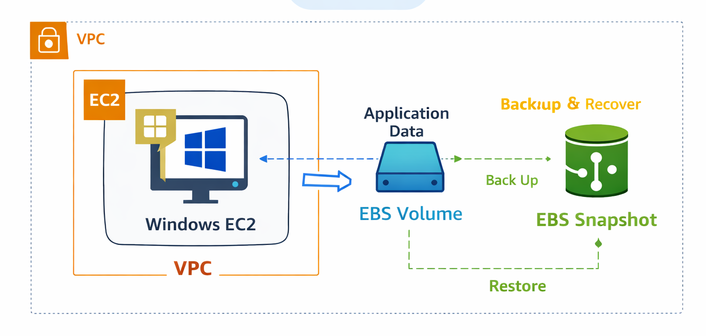
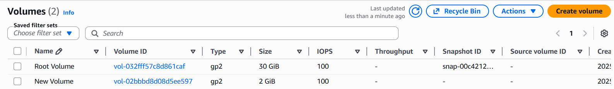
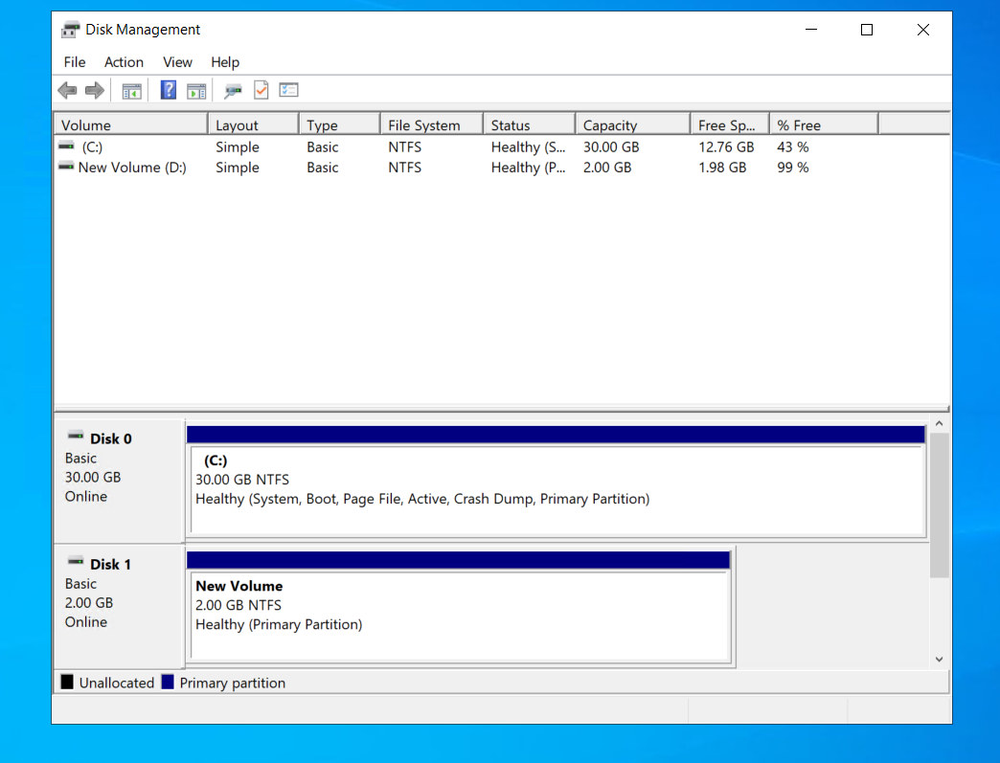
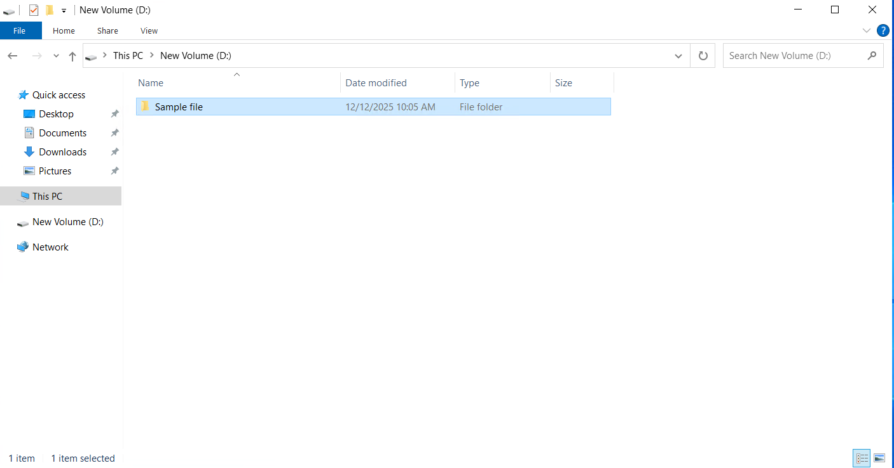
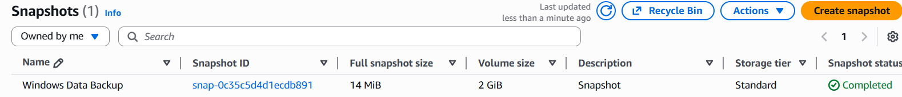
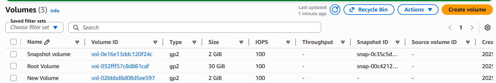
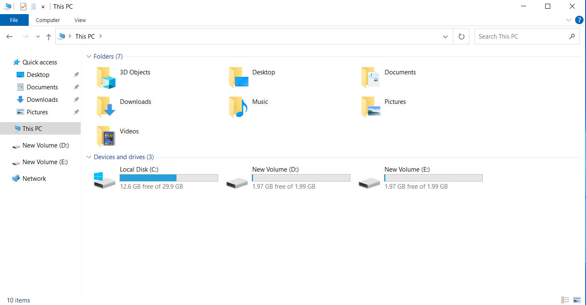

#  Amazon EBS Volumes & Snapshots on EC2 

This repository documents a **hands-on AWS Elastic Block Store (EBS)** project using a **Windows EC2 instance**.  The project focuses on **persistent storage**, **disk initialization**, and **data backup & recovery using EBS snapshots**

##  Architecture Diagram

### Architecture Description
- A **Windows EC2 instance** runs inside a VPC
- An **EBS data volume** is attached to the EC2 instance
- Application data is stored on the EBS volume
- **EBS Snapshots** are used to back up and restore data

##  Architecture Components

### Amazon EC2 (Windows Server)
Provides the compute environment where the application runs and where the EBS volume is attached.

### Amazon EBS Volume
Provides persistent block-level storage for application data, independent of the EC2 instance lifecycle.

### EBS Snapshots
Point-in-time backups of EBS volumes used for data recovery and disaster protection.

##  Data Flow 

1. Application writes data to the attached EBS volume  
2. Data is stored persistently on the EBS volume  
3. Snapshots are created to back up the stored data  
4. A new EBS volume can be restored from a snapshot  
5. Restored volume is attached to EC2 and data is recovered  

##  Features

- Persistent storage for EC2 using Amazon EBS  
- Disk initialization and formatting on Windows  
- Snapshot-based backup and recovery  
- Reliable data protection for cloud applications  

##  Hands-On Implementation

### Step 1: Launch EC2 Instance
- Launch a **Windows EC2 instance**
- Ensure the instance is in **Running** state

### Step 2: Create and Attach EBS Volume
Create a new EBS volume in the same Availability Zone and attach it to the EC2 instance.

### Step 3: Initialize and Format Disk
Initialize and format the attached volume using **Windows Disk Management**.

### Step 4: Add Sample Data
Assign a drive letter (D:) and add sample files to the volume.

### Step 5: Create Snapshot
Create a snapshot to back up the EBS volume data.

### Step 6: Restore Volume from Snapshot
Create a new EBS volume from the snapshot.

### Step 7: Verify Restored Data
Attach the restored volume and verify that data is successfully recovered.

##  Result

- Application data stored securely on an EBS volume  
- Snapshot created as a reliable backup  
- Data successfully restored without data loss  

##  Key Learnings

- Creating and attaching EBS volumes to EC2  
- Initializing and formatting disks on Windows  
- Creating and restoring EBS snapshots  
- Implementing data durability and recovery strategies in AWS  

