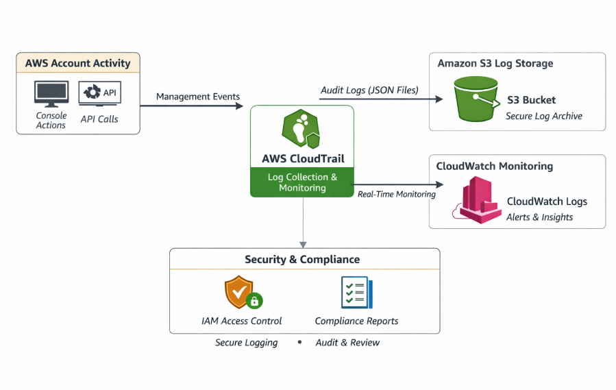
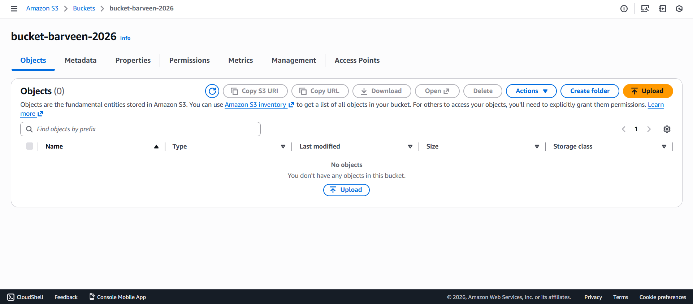
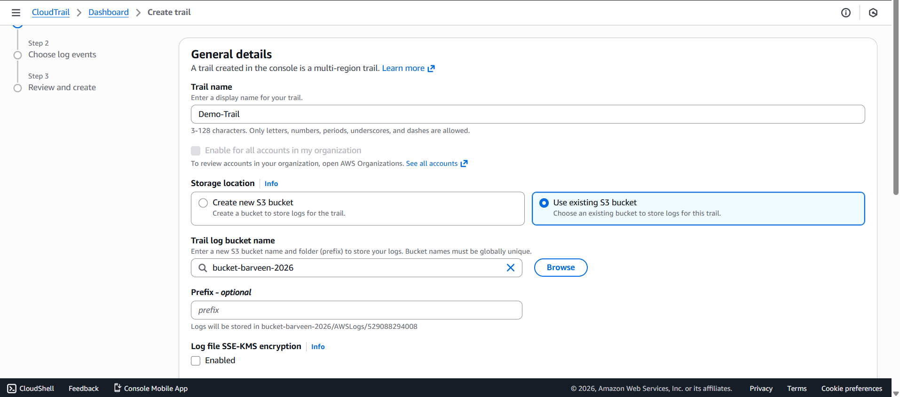
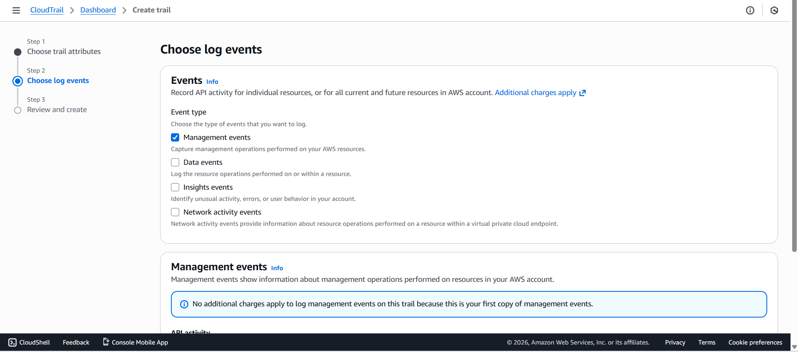
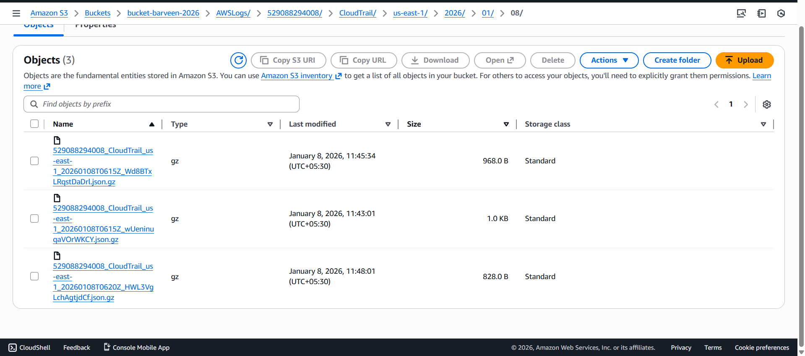

#  AWS CloudTrail – API Activity & Audit Logging

It demonstrates the implementation of **AWS CloudTrail** to monitor, record, and audit AWS account activity.
CloudTrail captures **API calls, console actions, and resource changes**, enabling security analysis, compliance auditing, and operational troubleshooting.

---

## Architecture Diagram

---

##  Key Features
- Records all AWS API activity  
- Tracks **who did what, when, and from where**  
- Stores logs securely in Amazon S3  
- Integrates with CloudWatch for real-time monitoring

---

##  Implementation Steps

## Step 1: Create a Bucket
1.Created an **Amazon S3 bucket** to store CloudTrail logs  
2.Enabled required permissions for CloudTrail to write logs  
3.Bucket used as centralized log storage 

---

## Step 2: Create Cloud Trail
1. Created an **AWS CloudTrail trail**
2. Selected the previously created S3 bucket as the log destination

---

## Step 3: Configured Management Event settings
1.Enabled **Management Events** to track AWS console and API activity  
2.Logged both **Read** and **Write** events  
3.Captured actions performed via AWS Management Console and AWS service

---

## Step 5: Verified log delivery  
1.Confirmed CloudTrail logs appeared in the S3 bucket  

---

##  Use Cases
- Security auditing and compliance  
- Incident investigation  
- Monitoring IAM changes  
- Tracking resource creation and deletion  

---

##  Result
- All AWS account activities successfully logged  
- API calls and console actions visible in CloudTrail logs  
- Centralized auditing and monitoring achieved  

---

##  Conclusion
It showcases how AWS CloudTrail provides complete visibility into AWS account activity, enabling secure operations, compliance auditing, and effective incident response.
   
