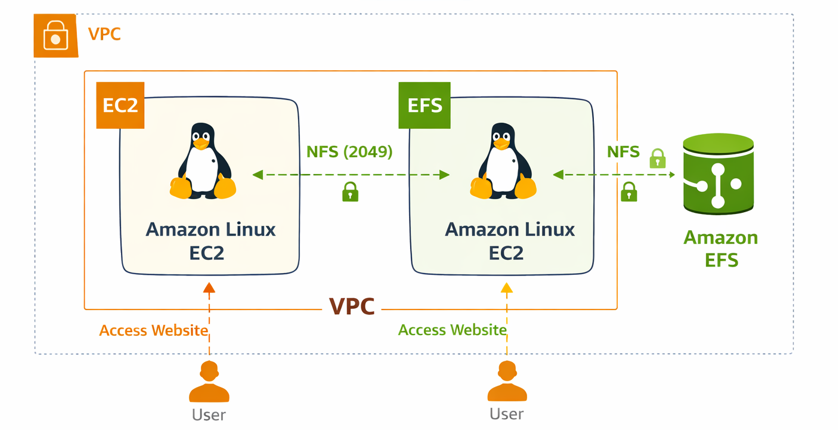
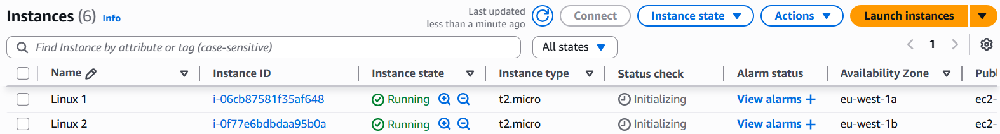
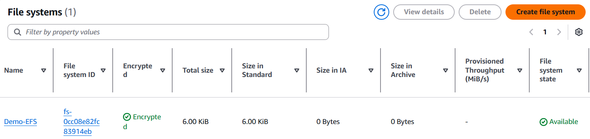
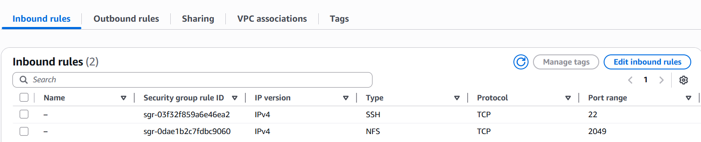

# Hosting a Shared Website Using Amazon EFS

This repository documents the setup and deployment of a **shared static website using Amazon Elastic File System (EFS)** across **two Amazon Linux EC2 instances**.  The project demonstrates **shared storage, NFS configuration, security group design, and real-time data synchronization** in AWS.

##  Architecture Diagram

## Architecture Overview

- Two Amazon Linux EC2 instances are launched in the same VPC.
- Amazon EFS provides a shared file system.
- EFS is mounted on both EC2 instances using NFS.
- Security Groups control SSH, HTTP, and NFS access.
- Users can access the same website using either EC2 public IPv4 address.

## 🧱 Architecture Components

### Amazon EC2 (Amazon Linux)
Provides virtual Linux servers to host and serve website content.

### Amazon EFS
A scalable, fully managed shared file system that allows multiple EC2 instances to access the same data simultaneously.

### Security Groups
Act as a virtual firewall controlling inbound and outbound traffic:
- SSH (22)
- HTTP (80)
- NFS (2049)

##  Request Flow 

1. User enters the EC2 public IPv4 address in a browser.
2. Request reaches the EC2 instance over HTTP (port 80).
3. EC2 reads website files from the mounted EFS directory.
4. Amazon EFS serves the same content to both EC2 instances.
5. Website is displayed in the user’s browser.

## Security & Access Flow

- SSH (22) for EC2 administration (restricted to My IP)
- HTTP (80) for public website access
- NFS (2049) allowed only between EC2 and EFS security groups

##  Features

- Shared website hosting using Amazon EFS
- Real-time data synchronization across EC2 instances
- Secure access using Security Groups
- Scalable and highly available storage
- Production-style shared file system architecture

##  Hands-On Implementation

### Step 1: Launch Amazon Linux EC2 Instances

- Navigate to **EC2 → Launch instance**
- Choose **Amazon Linux AMI**
- Select instance type (e.g., t2.micro)
- Create or select a key pair
- Launch **two EC2 instances** in the same VPC

  

### Step 2: Create Amazon EFS File System

- Navigate to **Amazon EFS**
- Create a new file system
- Select the same VPC
- Create mount targets in available subnets

  

---

### Step 3: Configure Security Groups for NFS

Inbound rules:
- SSH (22) → My IP
- HTTP (80) → 0.0.0.0/0
- NFS (2049) → EFS Security Group

 

### Step 4: Mount EFS on EC2 Instance 1

### Step 5: Mount EFS on EC2 Instance 2

### Step 6: Deploy Website Content Using Git

### Step 7: Access the Website Publicly

Copy EC2 Instance 1 public IPv4 address
Open in browser
Repeat with EC2 Instance 2 public IPv4
Verify both show the same website

### Result
The website is successfully hosted using Amazon EFS shared storage and is accessible from multiple EC2 instances with real-time synchronization.

