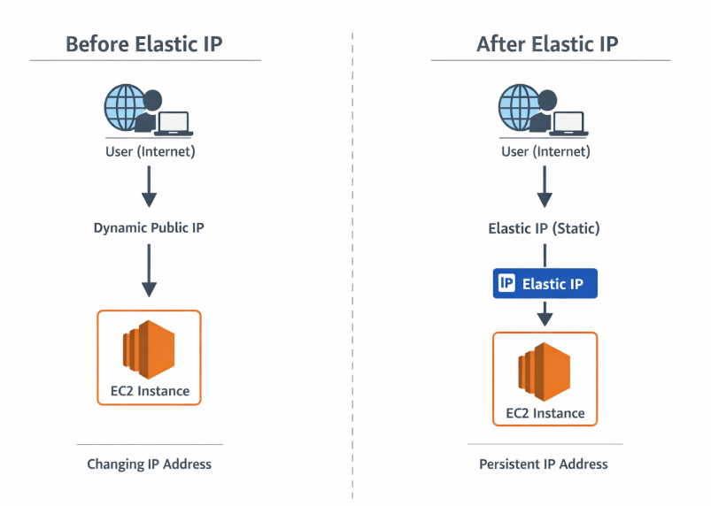
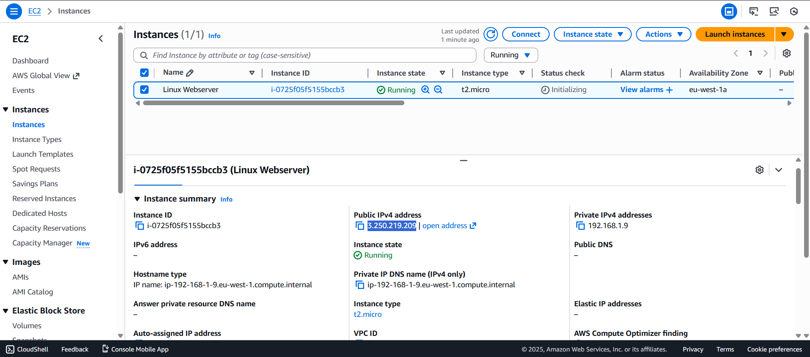
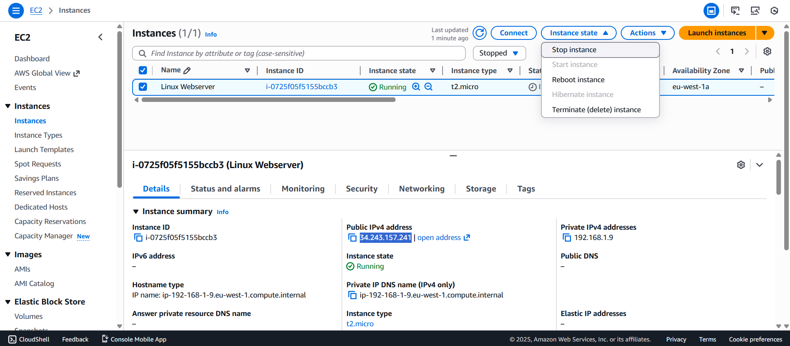
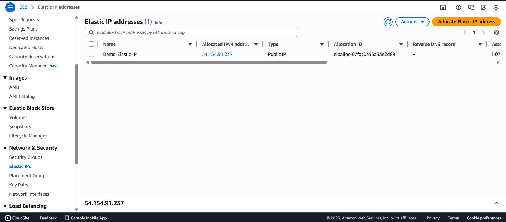
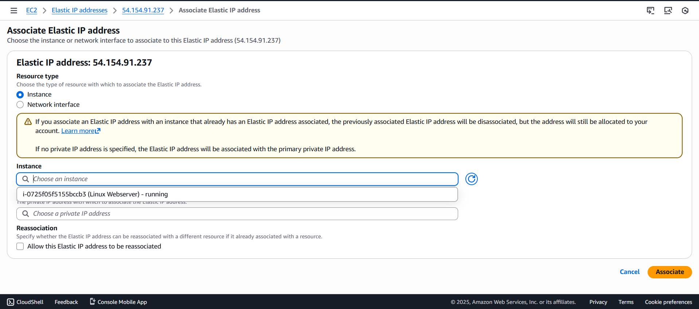
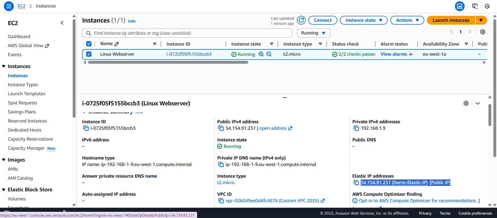

# AWS Elastic IP – Public IP Persistence for EC2

By default, an Amazon EC2 instance without an Elastic IP receives a **dynamic public IPv4 address**.  When the instance is **stopped and started**, AWS releases the old public IP and assigns a new one.

In this, we demonstrate:
- Public IP change without Elastic IP
- Allocation and association of Elastic IP
- Persistent public IP after instance restart

---

##  Architecture Diagram

---

##  Implementation Steps

### Step 1: Launch EC2 Instance (Without Elastic IP)
- Created an EC2 instance in a public subnet
- AWS automatically assigned a public IPv4 address
- Verified instance connectivity using the public IP

---

### Step 2: Stop and Start EC2 Instance
- Stopped the EC2 instance
- Started the instance again
- Observed that the **public IPv4 address changed**

---

### Step 3: Allocate an Elastic IP
- Navigated to **EC2 → Elastic IPs**
- Allocated a new Elastic IP address
- Elastic IP reserved in the AWS account

---

### Step 4: Associate Elastic IP with EC2 Instance
- Selected the allocated Elastic IP
- Associated it with the running EC2 instance
- Elastic IP replaced the dynamic public IP

---

### Step 5: Verify Elastic IP Persistence
- Stopped and started the EC2 instance again
- Verified that the **Elastic IP did not change**
- Instance remained accessible using the same IP

---

##  Key Learnings
- EC2 public IPs are **dynamic by default**
- Stopping an instance releases the public IP
- Elastic IP provides a **static public IP**
- Elastic IP is required for:
  - Production workloads
  - DNS-based access
  - Firewall IP whitelisting

---

##  Conclusion
It demonstrates how **Elastic IP ensures consistent public access** to an EC2 instance.  By associating an Elastic IP, the instance retains the same public IP even after stop and start operations, making it suitable for production and real-world applications.
