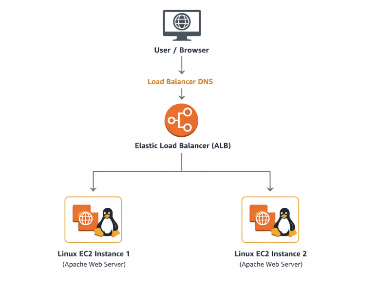
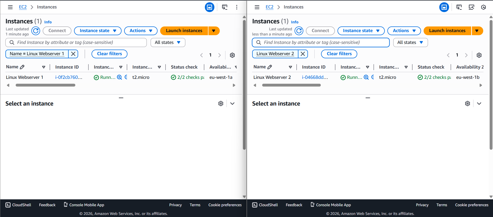
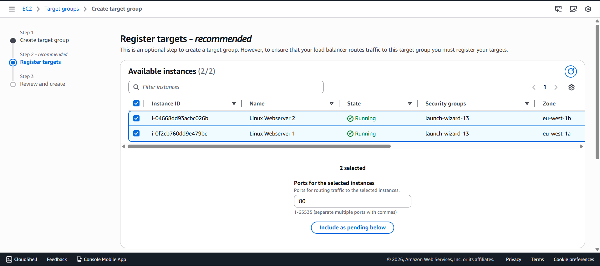
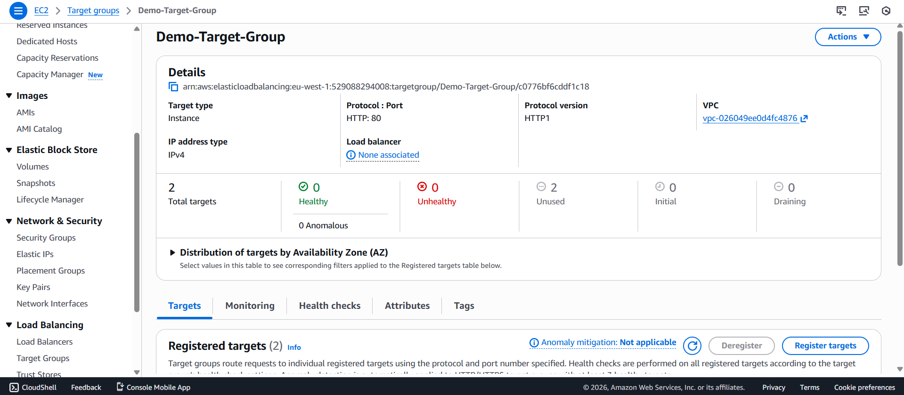
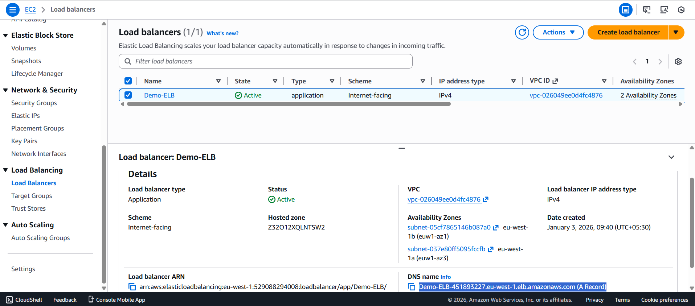
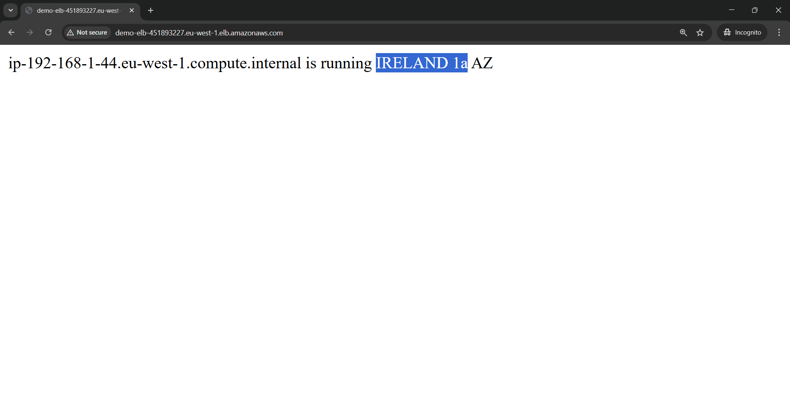

## Elastic Load Balancer (ELB)

This project demonstrates the implementation of an **AWS Elastic Load Balancer (Application Load Balancer)** to efficiently distribute incoming HTTP traffic across multiple Linux EC2 instances. The Elastic Load Balancer serves as a single entry point for users and routes requests only to healthy backend instances using a target group.

By placing two EC2 instances behind the load balancer, the architecture ensures **high availability, fault tolerance, and scalability**. When the Load Balancer DNS name is accessed through a browser, traffic is distributed across both instances and responses are received alternately, confirming successful load balancing.

---

## Architecture Diagram

---

## Implementation Steps

### Step 1: Launch Two Linux EC2 Instances
- AMI: Amazon Linux 
- Both instances are launched in the same VPC and subnet  
- Security Group configured to allow HTTP (Port 80)

---

### Step 2: Create Target Group
- Target Type: Instances  
- Protocol: HTTP  
- Port: 80  
- Registered both EC2 instances

---

### Step 3: Create Application Load Balancer
- Load Balancer Type: Application Load Balancer  
- Scheme: Internet-facing  
- Listener: HTTP (Port 80)  
- Attached the created target group

---

### Step 4: Test Load Balancer DNS Name
- Copied the Load Balancer DNS name  
- Pasted it into the browser  
- Refreshed multiple times  

🔄 Output alternates between:
- Response from EC2 Instance 1  
- Response from EC2 Instance 2  

---

###  Load Balancing Behavior
- Application Load Balancer distributes traffic using round-robin  
- Each browser refresh routes the request to a different EC2 instance  
- Ensures high availability and fault tolerance  

---

###  Result
- Application Load Balancer successfully distributes traffic  
- Both EC2 instances respond alternately  
- Target group health checks pass successfully  
- High availability achieved  

---

###  Conclusion
It proves the effective use of an Application Load Balancer to distribute incoming traffic across multiple EC2 instances, ensuring scalability, fault tolerance, and high availability in modern cloud architectures.

