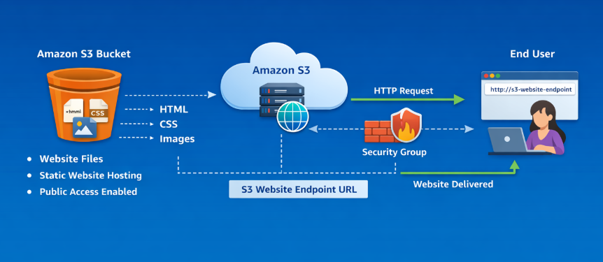
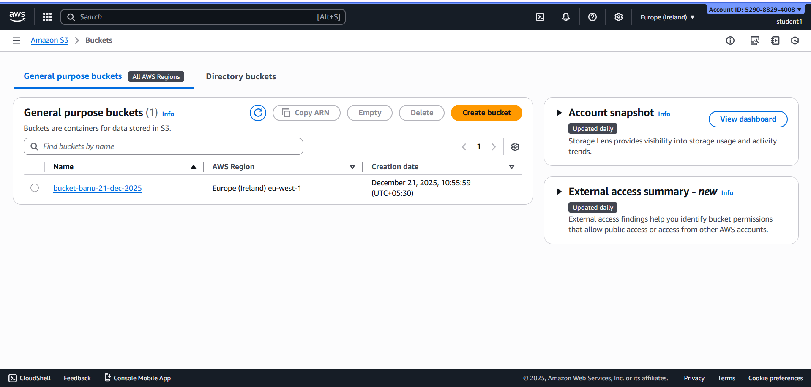
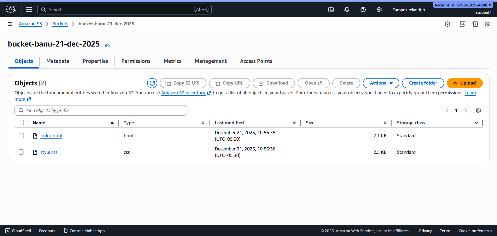
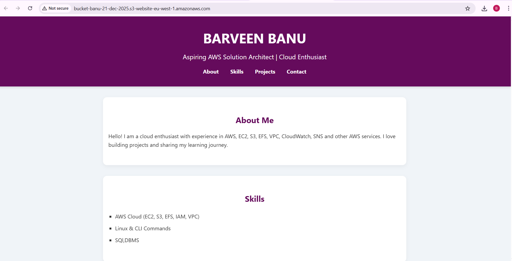

# Host a Static Website on AWS S3 

This repository documents the setup and deployment of a **static website hosted on Amazon S3** using **Static Website Hosting**.  The project focuses on serverless web hosting, public access configuration, and cloud storage fundamentals in AWS.

---

## Architecture

- Static website files are stored in an Amazon S3 bucket  
- Static Website Hosting is enabled on the bucket  
- Public access is enabled for website content  
- Users access the website via the S3 website endpoint URL  

---

## Architecture Components

### Amazon S3
Provides highly durable and scalable object storage to host static website files such as HTML, CSS, and images.

### Static Website Hosting
Allows Amazon S3 to serve static web content over HTTP without managing servers.

### Public Access Settings
Public access is enabled at the bucket level to allow users to view website files through the website endpoint.

---

## Request Flow (End-User Perspective)

1. A user opens the S3 website endpoint URL in a browser  
2. The request reaches the S3 bucket  
3. Amazon S3 retrieves the requested static files (`index.html`, CSS, images)  
4. The website content is returned to the browser  

---

## Security & Access Flow

- Public access is enabled only for static content  
- No server login, SSH, or RDP access is required  
- AWS manages the underlying infrastructure security  
- Access is limited to read-only website content  

---

## Features

- Serverless static website hosting  
- No server or OS management  
- Highly available and durable  
- Cost-effective hosting solution  
- Easy public access using an endpoint URL  

---

## Hands On

### Step 1: Create an S3 Bucket

- Open the AWS Management Console  
- Navigate to **S3 → Create bucket**  
- Enter a globally unique bucket name  
- Select a region  
- Create the bucket  

---

### Step 2: Upload Website Files

- Upload:
  - `index.html`
  - `style.css`
  

---

### Step 3: Enable Static Website Hosting

- Open the bucket → **Properties**  
- Enable **Static website hosting**  
- Select **Host a static website**  
- Set index document as `index.html`  

---

### Step 4: Access the Website Publicly

- Copy the **S3 website endpoint URL**  
- Open the URL in a web browser  
- Verify the website loads successfully  

---

## Result

The static website is successfully hosted on **Amazon S3** and is publicly accessible using the S3 website endpoint URL.  This project demonstrates a **simple, scalable, and serverless web hosting solution** using AWS.

---

