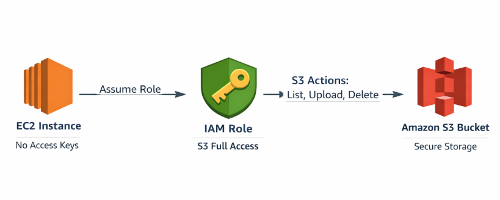
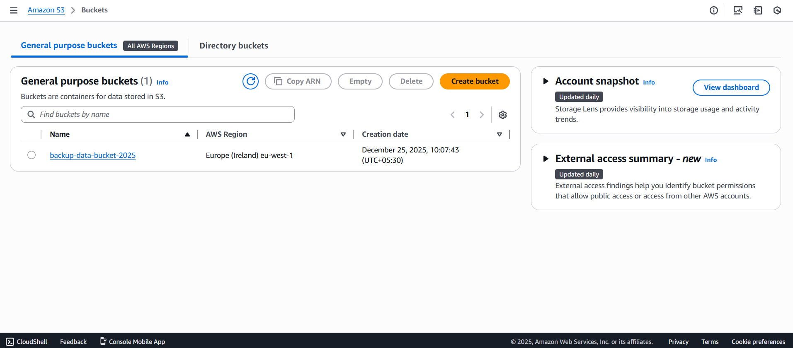
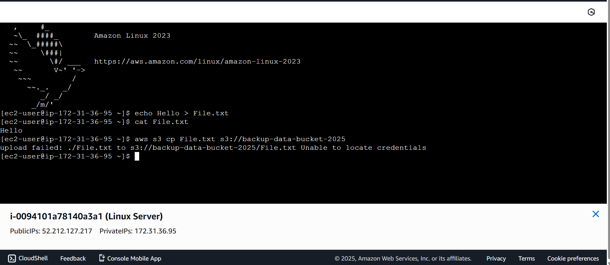
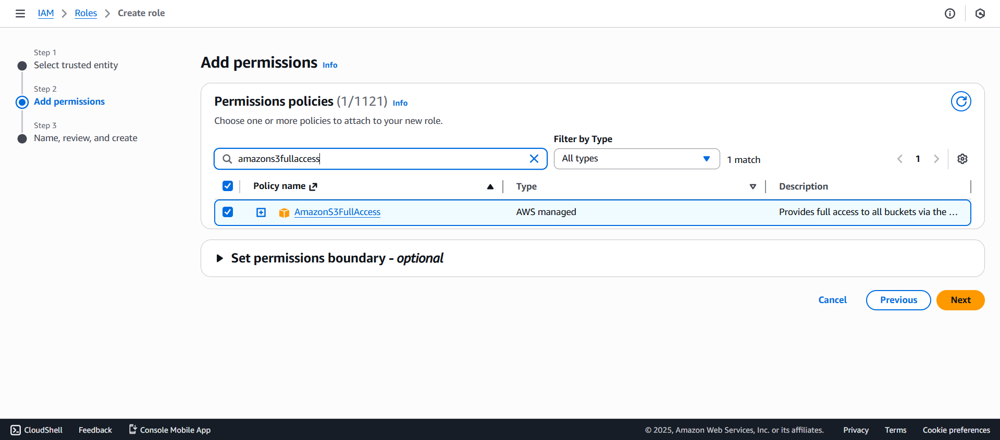
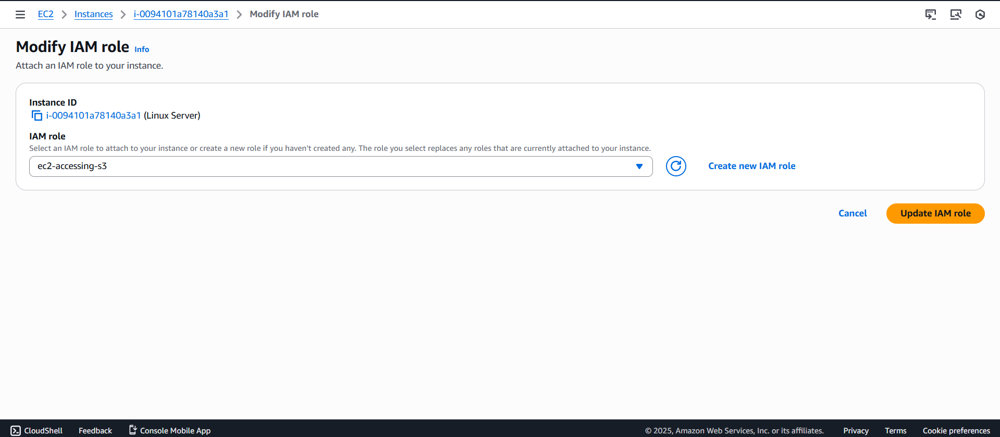
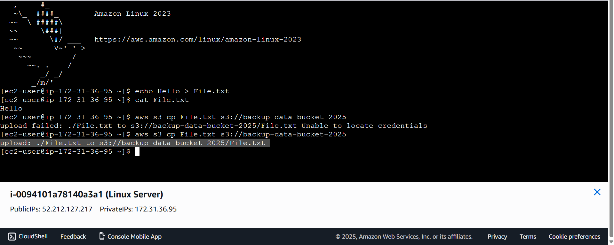
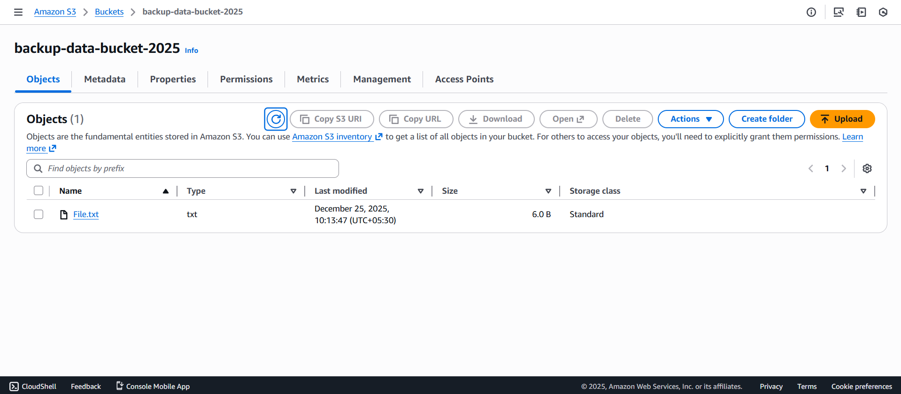

### IAM Role for EC2 Accessing S3

Instead of embedding access keys inside your server (risky), AWS provides a secure and scalable way for EC2 to talk to S3 using IAM roles.
Whenever an application running on EC2 needs to upload, download, or read data from S3, AWS automatically provides temporary credentials — no manual key management required.

---

### Architecture Diagram

- An Amazon S3 bucket was created successfully
- Uploading data to the bucket from EC2 failed with **Access Denied**
- An IAM Role with **S3 Full Access** was created
- The IAM Role was attached to the EC2 instance
- After attaching the role, the upload succeeded

---

### Step 1: Create an S3 Bucket

An S3 bucket was created using the AWS Management Console.

---

### Step 2: Upload Attempt Fails (Access Denied)

When trying to upload files from the EC2 instance to the S3 bucket, the operation failed due to missing permissions.

---

### Step 3: Create IAM Role and Attach Policy

An IAM Role was created to allow the EC2 instance to securely access Amazon S3.

#### Steps:
1. Create a new IAM Role  
2. Select **AWS service** as the trusted entity  
3. Choose **EC2** as the use case  
4. Attach the AWS managed policy **AmazonS3FullAccess**  
5. Complete the role creation 

---

### Step 4: Attach IAM Role to EC2 Instance

The IAM Role was attached to the running EC2 instance to allow secure access to Amazon S3.

#### Steps:
1. Select the EC2 instance  
2. Click **Actions → Security → Modify IAM role**  
3. Attach the newly created IAM Role 

---

### Step 5: Upload Data Successfully

After attaching the IAM Role, the upload to the Amazon S3 bucket was retried and completed successfully.

#### Outcome:
- ✅ No access keys used  
- ✅ No secret keys used  
- ✅ Secure, role-based access enabled

  

### Result
This project demonstrates how an S3 upload failure caused by missing permissions can be resolved by attaching an IAM Role with S3 Full Access to an EC2 instance.
IAM Roles ensure secure, scalable, and credential-free access to AWS resources.

