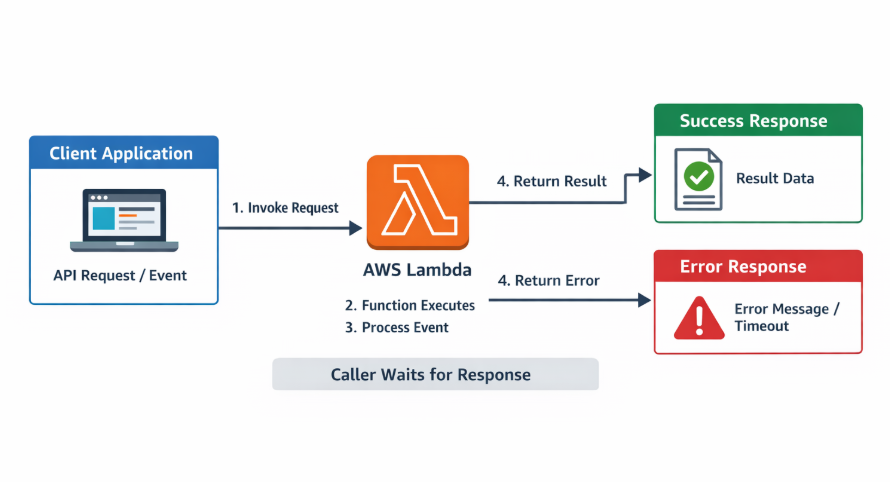
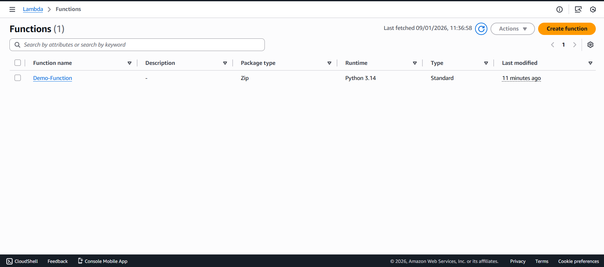
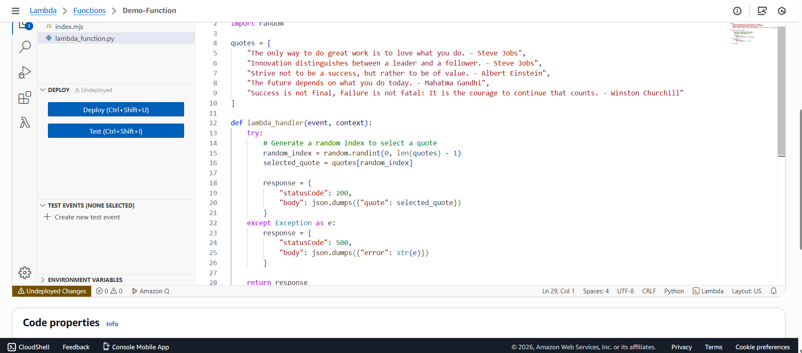
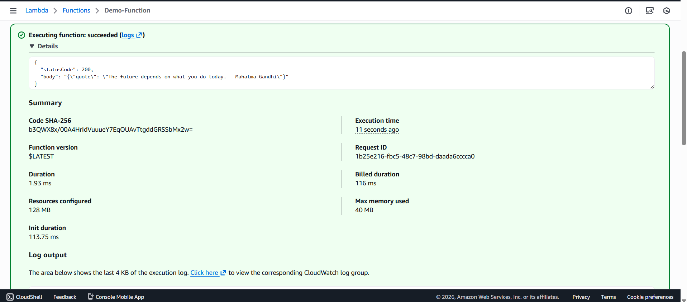
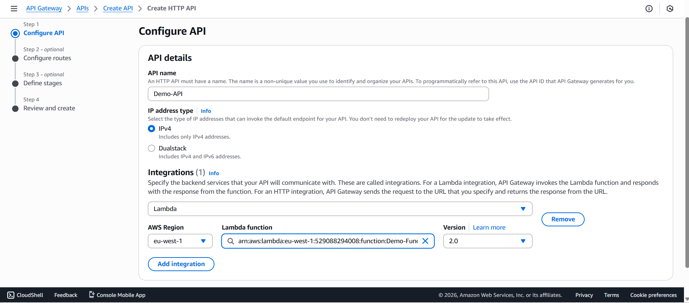
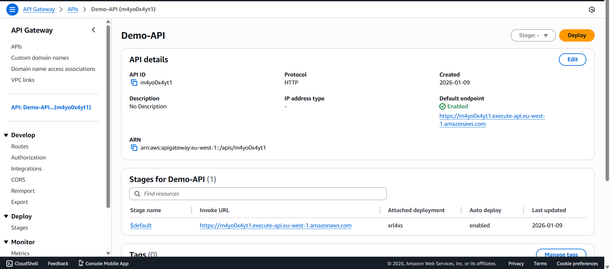
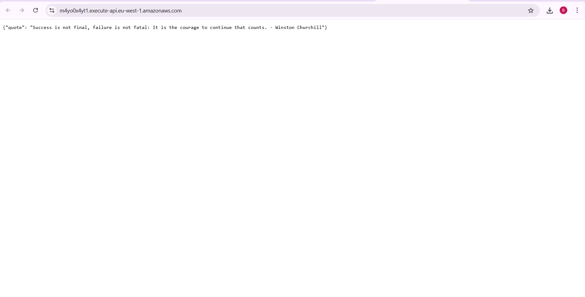

# Lambda - Synchronous Invocation

It demonstrates a simple **AWS Lambda function** written in Python, integrated with **API Gateway** to serve HTTP responses. It shows how to deploy a Lambda function, test it, and make it accessible via an API endpoint.

---

## Architecture Diagram

---

##  Features

- Python-based AWS Lambda function.
- Lambda triggered via **API Gateway**.
- Testable outputs directly in the **AWS Lambda console** or via the **API endpoint** in the browser.
- Quick deployment for serverless applications.

---

##  Implementation Steps

### Step 1: Create Lambda Function
- Go to **AWS Lambda** in the console.
- Click **Create function** → Choose **Python runtime**.
- Pasted  Python code into the editor.
- Click **Deploy** to save changes.

---

### Step 2: Test Lambda Function
- Open the **Test** tab in the Lambda console.
- Click **Test** → Verify the output appears correctly.

---

### Step 3: Create API Gateway
- Go to **API Gateway** in AWS console → Create a **REST API**.
- Choose **ANY** Method
- Deploy the API to a $default stage
- Copy the **API endpoint URL**.

---

### Step 4: Access the API
- Open the API endpoint URL in a browser.
- The Lambda function output should be displayed.

---

##  Result
- The Lambda function executes successfully in AWS.
- API Gateway triggers the Lambda function and returns the output.
- Browser or API clients like Postman can access the output.

---

##  Conclusion
This project demonstrates a basic serverless architecture using **AWS Lambda** and **API Gateway**. It shows how to:
- Deploy Python code as a Lambda function.
- Test it locally in the AWS console.
- Integrate Lambda with API Gateway for browser-accessible output.

This setup forms the foundation for building **scalable, serverless applications** on AWS.
