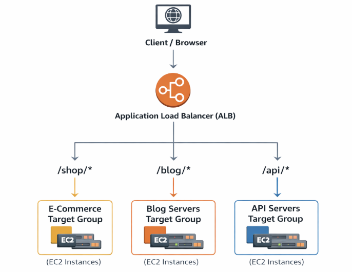
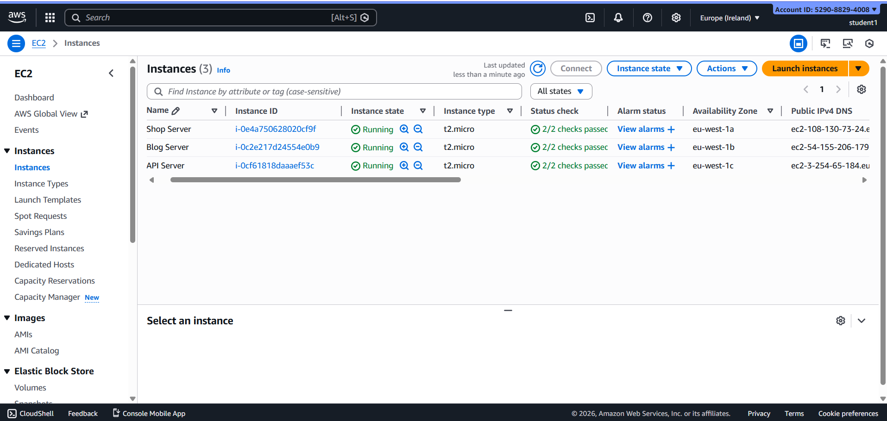
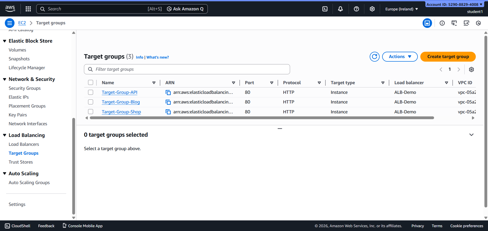
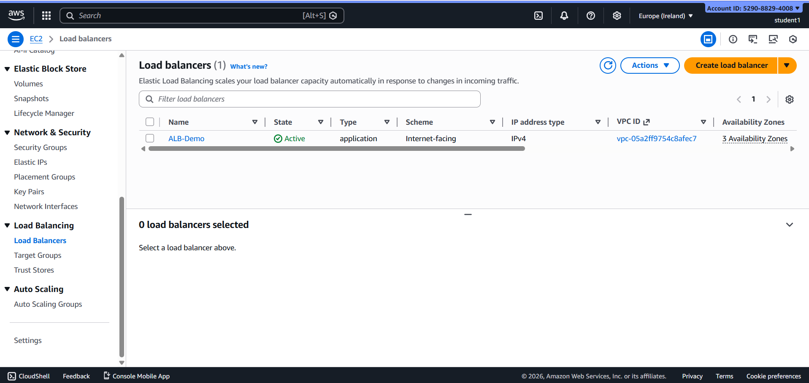
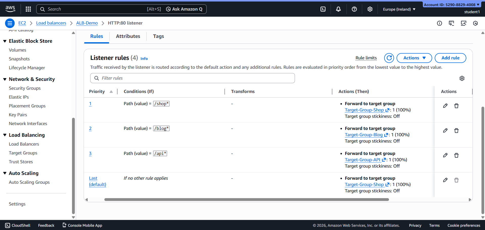
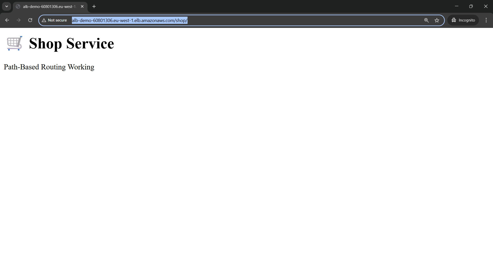
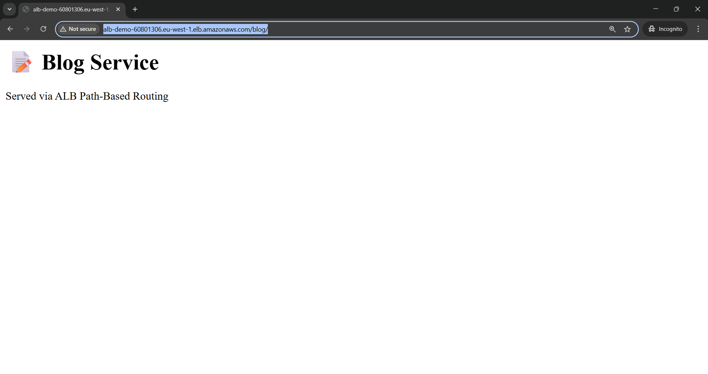

#  Application Load Balancer – Path-Based Routing

It demonstrates **Path-Based Routing** using an **AWS Application Load Balancer (ALB)**. Incoming client requests are routed to different backend server groups based on the **URL path**. This approach allows multiple applications or services to run behind a single load balancer efficiently.

---

## Architecture Diagram

---

##  Implementation Steps

### Step 1: Create EC2 Instances
- Launch EC2 instances for:
  - E-Commerce service
  - Blog service
  - API service

--

### Step 2: Create Target Groups
- Create separate target groups for each service:
  - **Shop Target Group**
  - **Blog Target Group**
  - **API Target Group**
- Protocol: HTTP  
- Port: 80  
- Register respective EC2 instances in each target group

---

### Step 3: Create Application Load Balancer
- Load Balancer Type: Application Load Balancer  
- Scheme: Internet-facing  
- Listener: HTTP (Port 80)

 

---

### Step 4: Configure Path-Based Listener Rules
Create listener rules to route traffic based on URL path:

- **Path:** `/shop/*`  
  → Forward to **Shop Group**

- **Path:** `/blog/*`  
  → Forward to **Blog Target Group**

- **Path:** `/api/*`  
  → Forward to **API Target Group**

 

---

### Step 5: Test Path-Based Routing
- Access the Load Balancer DNS name with different paths:
  - `http://<ALB-DNS>/shop`
  - `http://<ALB-DNS>/blog`
  - `http://<ALB-DNS>/api`

Each request is routed to the corresponding backend service.

 

 

---

## Result
- Traffic is routed correctly based on URL paths
- Each service responds independently
- Efficient utilization of load balancer resources
- High availability and scalability achieved

---

## Conclusion
It demonstrates how **Application Load Balancer Path-Based Routing** enables routing of traffic to different backend services using URL paths. It is a powerful feature for hosting **microservices, APIs, and multi-application architectures** behind a single load balancer, ensuring scalability, fault tolerance, and clean traffic separation.

 

