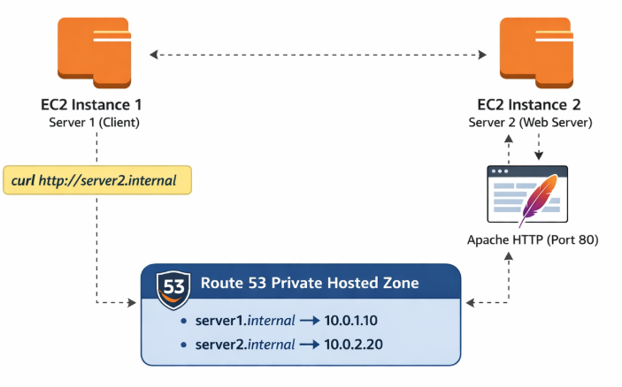
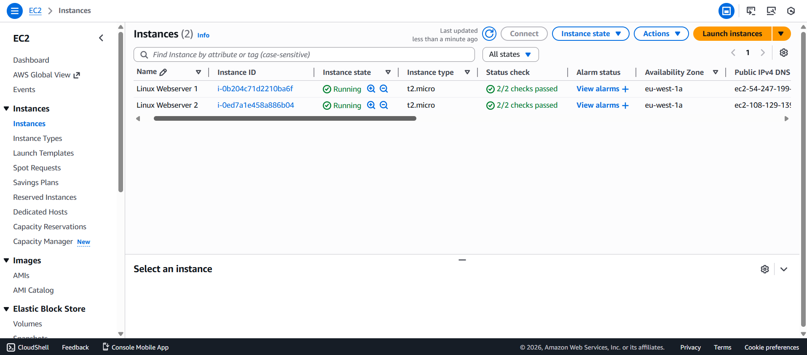
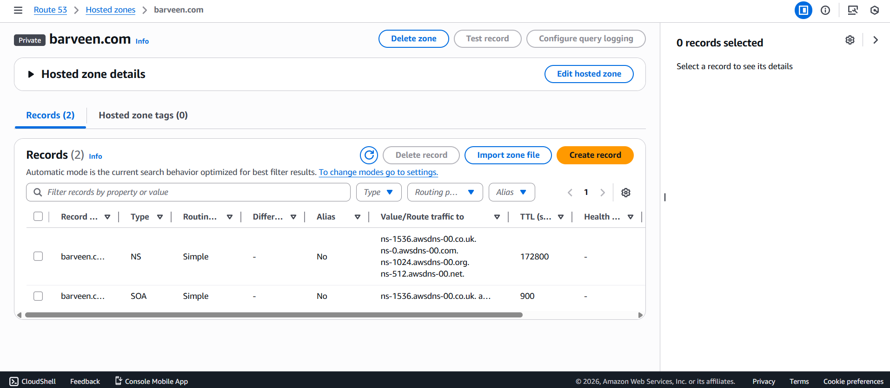
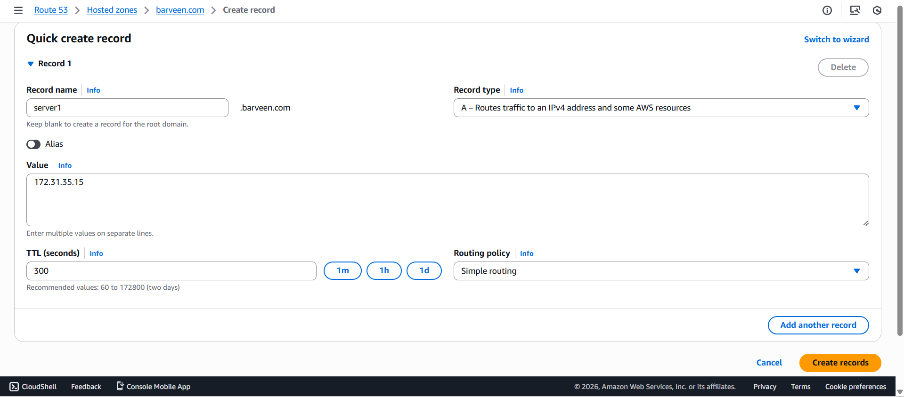
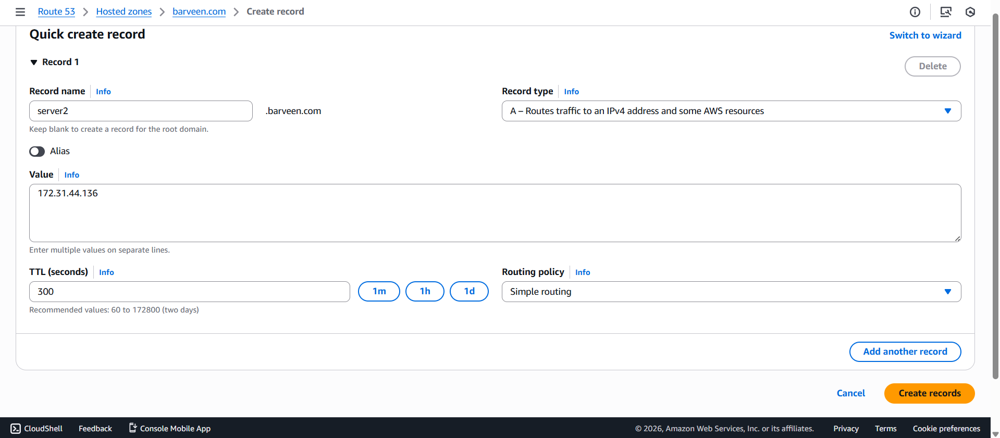
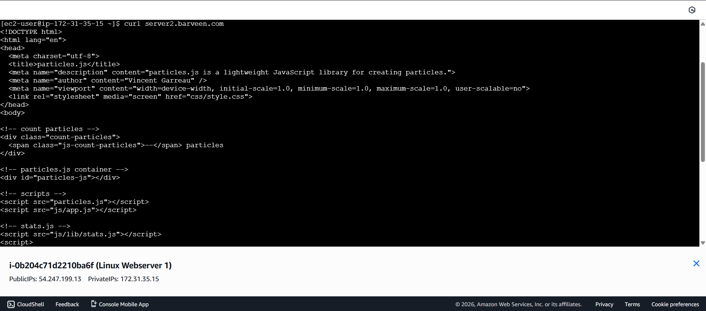

###  Route 53 Private Hosted Zone 

AWS Route 53 Private Hosted Zones allow you to manage DNS within one or more Amazon VPCs.  
It provides secure and reliable internal DNS resolution, enabling EC2 instances to communicate using private DNS names without exposing resources to the public internet.  

**Key Features:**
- Internal DNS resolution within a VPC
- Secure communication between instances
- No need for public IPs or internet access
- Supports multiple VPCs for shared DNS

---

## Architecture Diagram

---

##  Implementation Steps

### Step 1: Launch Two Linux EC2 Instances
- Launch **two Amazon Linux  EC2 instances**
- Place both instances in the **same VPC**
- Ensure **security group allows HTTP (port 80)**

---

### Step 2: Create Route 53 Private Hosted Zone

- Navigate to **Route 53 → Hosted Zones**
- Create a **Private Hosted Zone**
- Domain name: barveen.com
- Associate the hosted zone with the target **VPC**

---

### Step 3: Create DNS Records

**Record for Server 1**
- Record name: `server1.barveen.com`
- Record type: `A`
- Value: *Private IP address of Server 1*

**Record for Server 2**
- Record name: `server2.barveen.com`
- Record type: `A`
- Value: *Private IP address of Server 2*

---

### Step 4: Test DNS Resolution from Server 1

Connect to **Server 1** and verify internal DNS resolution by accessing Server 2 using its private DNS name:
   - curl server2.barveen.com

---

### Result

- Private Hosted Zone successfully resolved DNS names
- Server 1 accessed Server 2 using private DNS
- No public IP or internet routing was required
- Secure internal communication achieved

---

### Conclusion

It demonstrates how AWS Route 53 Private Hosted Zones enable secure and reliable internal DNS resolution within a VPC.  
By using private DNS records, EC2 instances can communicate efficiently without exposing services to the public internet.
