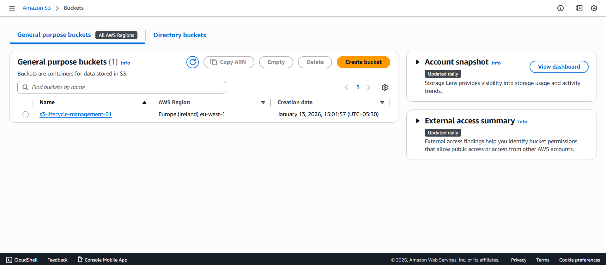
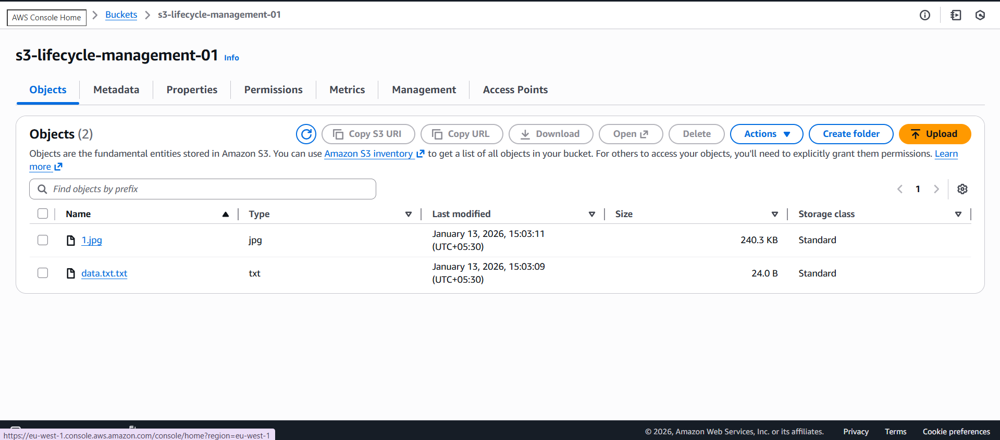
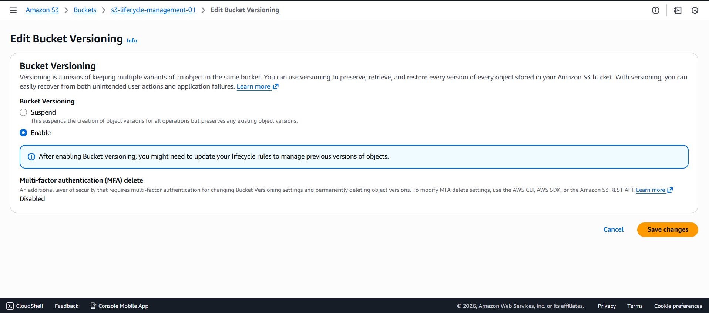
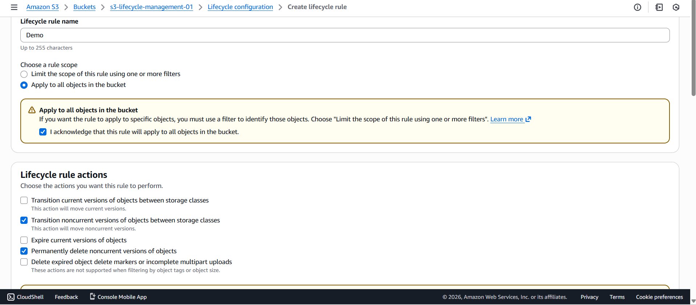
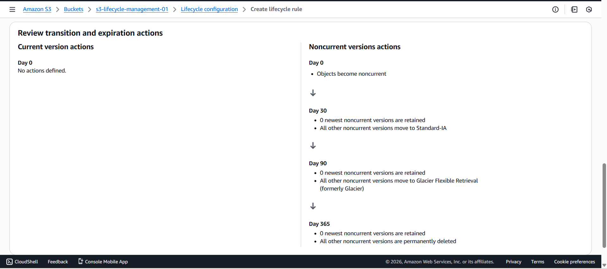

#  Amazon S3 Lifecycle Management

##  Project Overview
This project demonstrates how **Amazon S3 Lifecycle Management** automatically transitions objects between storage classes and deletes old versions to **optimize storage costs** without manual intervention. Lifecycle rules are commonly used in real-world applications for logs, backups, and archival data.

---

##  Architecture Diagram

---

##  Implementation Steps

### Step 1: Create an S3 Bucket
- Created a new S3 bucket using the AWS Management Console
- Selected a region and kept default settings

 

---

### Step 2: Upload Objects to the Bucket
- Uploaded sample files such as text, image, and PDF files
- All files were initially stored in **S3 Standard** storage class

  

---

### Step 3: Enable Versioning
- Enabled **S3 Versioning** to manage object versions
- Helps lifecycle rules manage noncurrent object versions

 

---

### Step 4: Create Lifecycle Rule
- Navigated to **Management → Lifecycle rules**
- Created a rule to apply to **all objects in the bucket**

 

---

### Step 5: Configure Lifecycle Transitions
Configured the following actions:
- After **30 days** → Move objects to **Standard-IA**
- After **90 days** → Move objects to **Glacier Flexible Retrieval**
- Noncurrent versions moved to **Standard-IA**
- Noncurrent versions deleted after **365 days**

 

---

##  Result
Objects in the S3 bucket are automatically:
- Transitioned to lower-cost storage classes over time
- Old versions are deleted after the retention period
- Storage cost is optimized without manual effort

##  Conclusion
Amazon S3 Lifecycle Management is a powerful feature that helps reduce storage costs by automatically moving and deleting objects based on defined rules. It is widely used in real-world cloud architectures for efficient data management.
