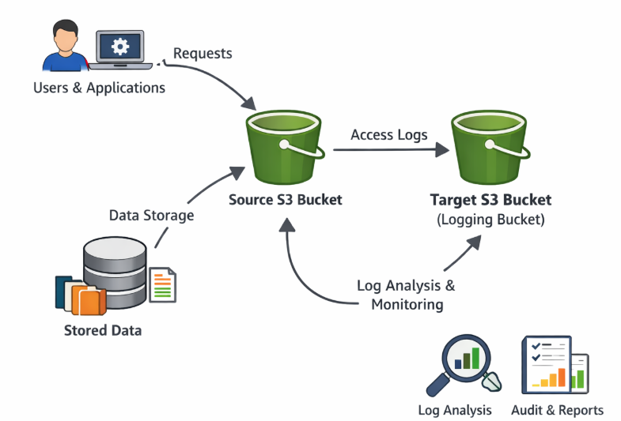
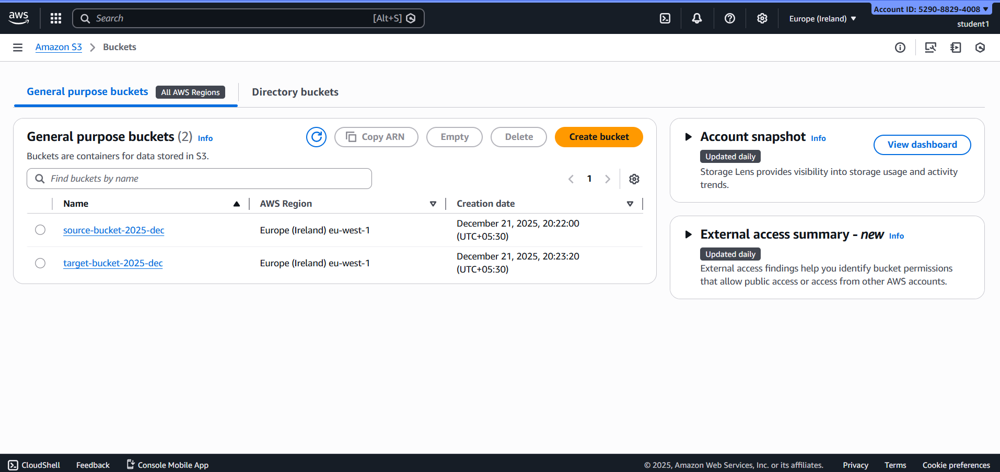
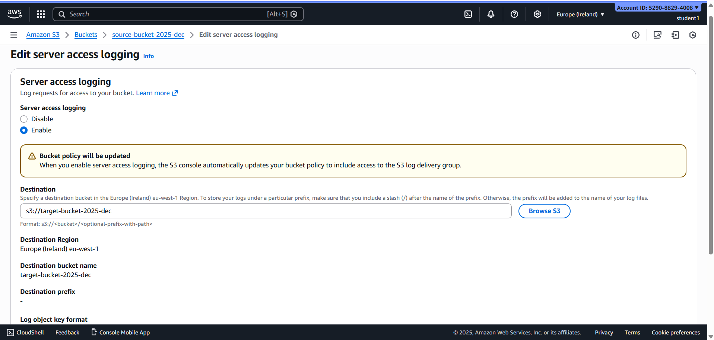
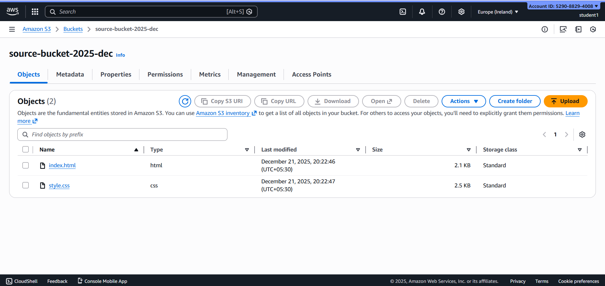
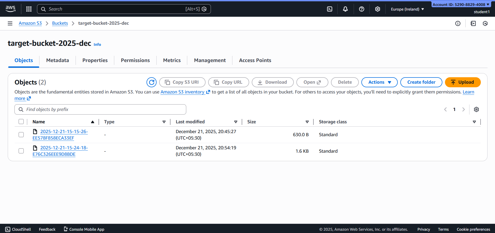

### Amazon S3 Server Access Logging

Amazon S3 **Server Access Logging** records detailed information about requests made to your S3 buckets.  It helps in **security auditing, compliance, monitoring access patterns, and troubleshooting issues**. When enabled, Amazon S3 automatically delivers access log files to a **separate target bucket**.

---

### Architecture Diagram

**Architecture Flow:**
1. Users or applications send requests to the Source S3 Bucket
2. Amazon S3 captures request metadata
3. Access logs are generated
4. Logs are delivered to the Target S3 Bucket

---

### Steps

### Step 1: Create Buckets

1.Two buckets were created:
2.Source Bucket: Holds the main files for the application.
3.Destination Bucket: Stores the server access logs generated by the source bucket.
This separation ensures that logs are stored safely without interfering with primary data.

---

### Step 2: Enable Server Access Logging

1.Server Access Logging was enabled on the source bucket. 
2.This ensures that every request made to the source bucket — including uploads, downloads, and deletions — is recorded and stored in the destination bucket.
3.Logs are stored with a timestamped prefix for easy organization.
4.Each log entry includes details like requester IP, request type, object name, and response status.

---

### Step 3: Upload Objects in source bucket

A set of test objects was uploaded to the source bucket to trigger logging and monitor activity.

---

### Step 4: Verify Logs

1.After file uploads, the logs appeared in the destination bucket. Each log entry provides:
2.Bucket Name: The source bucket receiving requests
3.Requester Info: Identity of the user or service
4.Request Type: e.g., GET, PUT, DELETE
5.Timestamp: When the request occurred
6.Status Code: Whether the request was successful
By analyzing these logs, we can monitor access patterns, detect anomalies, and ensure compliance with security policies.

---

### Result

Amazon S3 Server Access Logging helps monitor and track all access to an S3 bucket.  It improves security, supports auditing, and makes troubleshooting easier by storing logs in a separate bucket.

