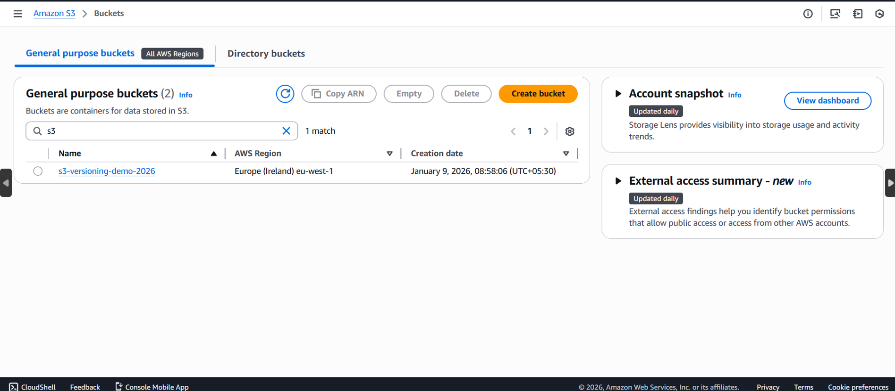
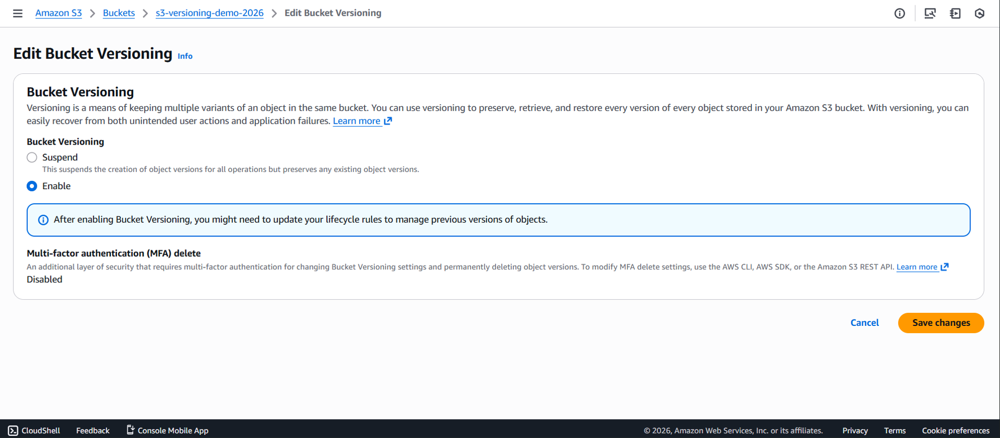
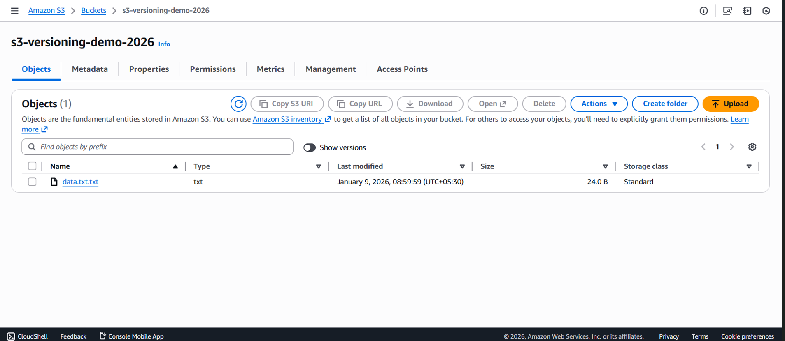
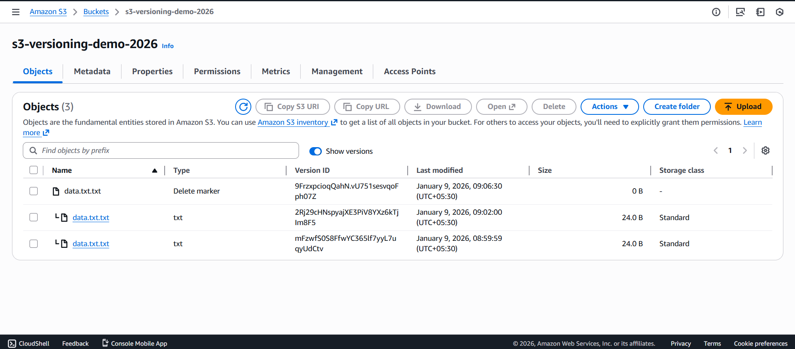

# Data Protection and Recovery using Amazon S3 Versioning

##  Project Overview
This project demonstrates how **Amazon S3 Versioning** protects data by storing multiple versions of an object and allows recovery from accidental deletions or overwrites.

---

##  AWS Services Used
- Amazon S3

---

##  Architecture Diagram

The diagram shows how Amazon S3 maintains multiple object versions and uses delete markers for recovery.

---

##  Request Flow
1. User uploads an object to the S3 bucket.
2. S3 stores the object as the **latest version**.
3. When the same object is updated, S3 creates a **new version** instead of overwriting.
4. When the object is deleted, S3 places a **delete marker**.
5. Previous object versions remain stored in the bucket.
6. User can restore the object by removing the delete marker.

---

###  Step 1: Create an S3 Bucket
- Open **Amazon S3 → Create bucket**
- Enter a unique bucket name
- Choose a region
- Leave other settings as default
- Click **Create bucket**

 

---

###  Step 2: Enable Versioning
- Open the created bucket
- Go to the **Properties** tab
- Enable **Bucket Versioning**
- Save changes

 

---

###  Step 3: Upload First Version of an Object
- Create a file named `data.txt`
- Add content:
Version 1 - Initial file

---

### Step 4: Upload Second Version (Overwrite File)
- Modify the same `data.txt` file:
Version 2 - Updated file
- Upload again using the same filename

✅ S3 stores this as a **new version**, not an overwrite.

---

###  Step 5: View Object Version History
- Select the uploaded object
- Enable **Show versions**
- Observe multiple versions with unique **Version IDs**

---

###  Step 6: Delete the Object
- Delete `data.txt` from the bucket

⚠️ S3 does NOT permanently delete the file  
➡️ It creates a **Delete Marker**

---
### Result
Amazon S3 Versioning provides a reliable and simple solution for data protection by maintaining object history and enabling easy recovery.

