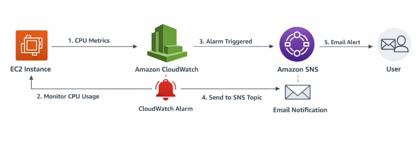
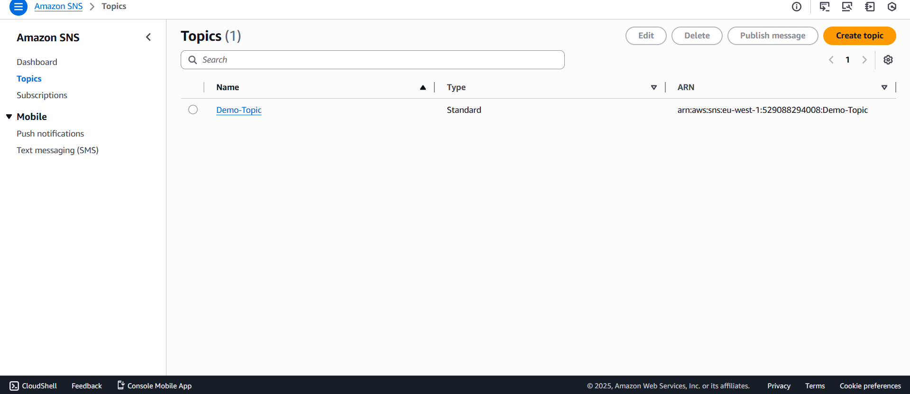
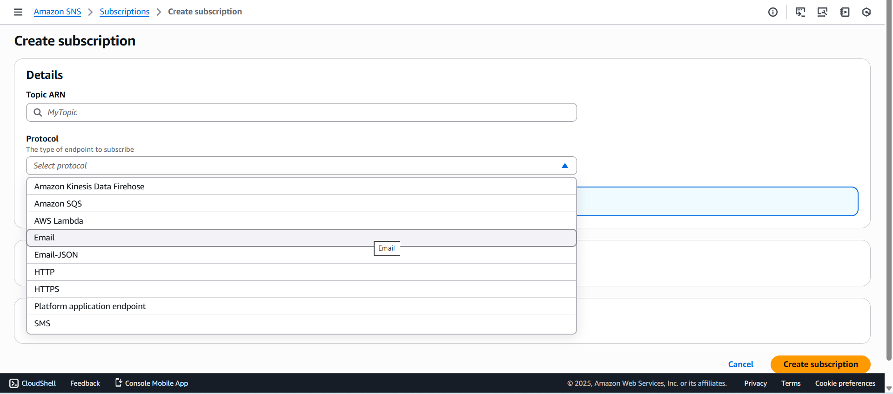
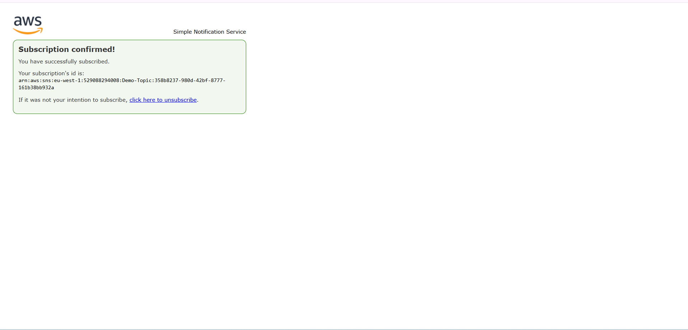
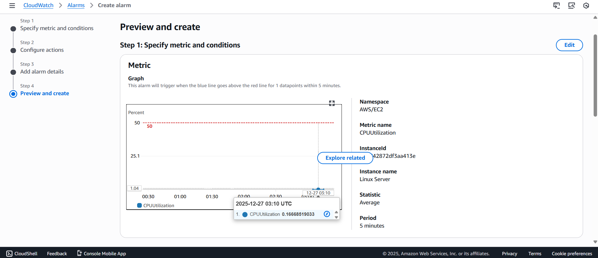
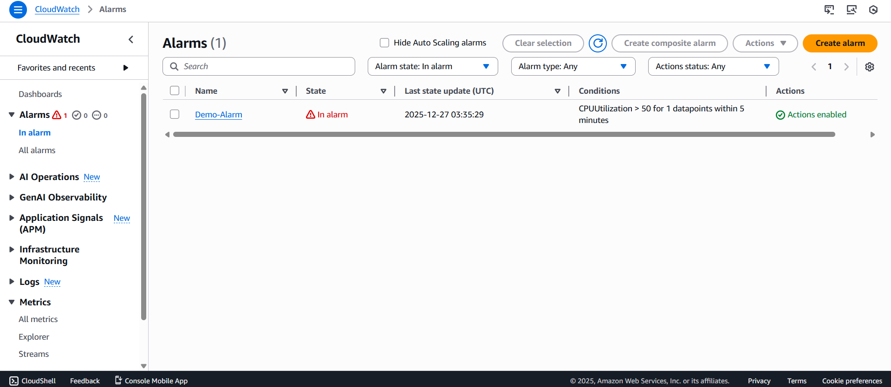
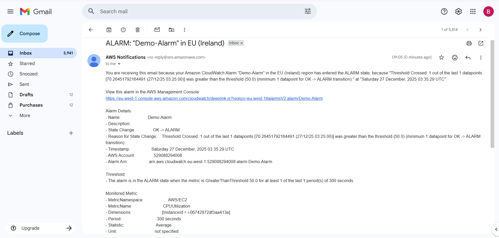

#  AWS CloudWatch Alarm with SNS Email Notification

##  Project Overview
It demonstrates how to configure an **Amazon CloudWatch Alarm** that monitors an **EC2 CPU utilization metric** and sends an **email notification using Amazon Simple Notification Service (SNS)** when a defined threshold is breached. This is a common real-world monitoring and alerting setup used in production environments.

---

##  Architecture Diagram

### Architecture Flow
1. EC2 instance generates CPU metrics
2. CloudWatch monitors CPUUtilization
3. Alarm is triggered when threshold exceeds limit
4. Alarm publishes message to SNS topic
5. SNS sends email notification to subscriber

---

##  Implementation Steps

## Step 1: Create SNS Topic
1. Open **Amazon SNS Console**
2. Click **Create topic**
3. Configure:
- **Type**: Standard
- **Topic Name**: `demo-topic`
4. Click **Create topic**
  

---

## Step 2: Create Email Subscription
1. Open the SNS topic
2. Click **Create subscription**
3. Configure:
- **Protocol**: Email
- **Endpoint**: your-email@example.com
4. Click **Create subscription**

  

---

## Step 3: Confirm Subscription
1. Open your email inbox
2. Click **Confirm subscription** in the SNS email
3. Subscription status becomes **Confirmed**

  

---

## Step 4: Create CloudWatch Alarm
1. Open **CloudWatch → Alarms**
2. Click **Create alarm**
3. Select metric:
    EC2 → Per-Instance Metrics → CPUUtilization
4. Set condition:
    - Threshold: **Greater than 50%**
5. Click **Next**
6. Notification:
    - Select SNS topic: 'demo-topic'
7. Alarm name:
    - demo alarm
  

## Step 5: Alarm Triggered & Email Notification

Once the CPU utilization exceeds the configured threshold (**50%**), the CloudWatch alarm is automatically triggered.

### What Happens:
- EC2 CPU utilization rises above **50%**
- CloudWatch alarm state changes from **OK** to **In alarm**
- Alarm publishes a message to the SNS topic
- SNS sends an **email notification** to the subscribed email address

  

---

## Result

- EC2 CPU utilization was continuously monitored using **Amazon CloudWatch**
- CloudWatch alarm was successfully triggered when CPU usage exceeded **50%**
- Alarm state changed from **OK** to **In alarm**
- Alarm published a notification to the **SNS topic**
- **Email notification** was successfully delivered to the subscribed email address
- End-to-end monitoring and alerting workflow worked as expected

---

## Conclusion

It demonstrates a complete **monitoring and alerting solution** using **Amazon CloudWatch and Amazon SNS**. By configuring alarms on critical metrics and integrating them with SNS, system administrators can receive **real-time notifications** whenever performance thresholds are breached.

This setup helps in:
- Faster incident detection
- Proactive system monitoring
- Improved system reliability
- Reduced downtime through timely alerts

It validates how AWS native services can be effectively combined to build a **scalable, automated, and reliable alerting mechanism** for cloud infrastructure.
