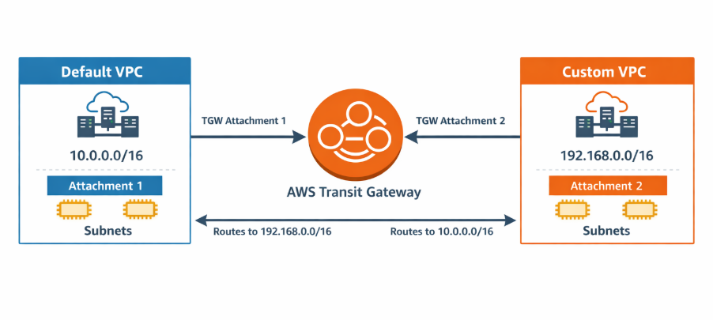
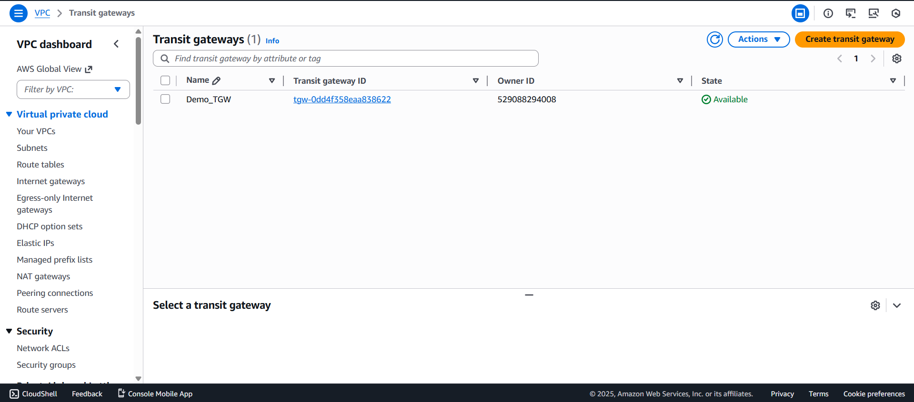
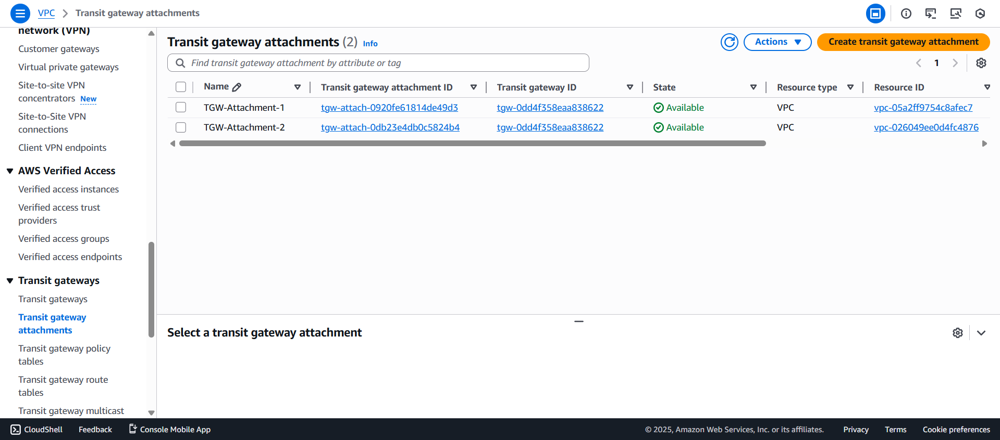
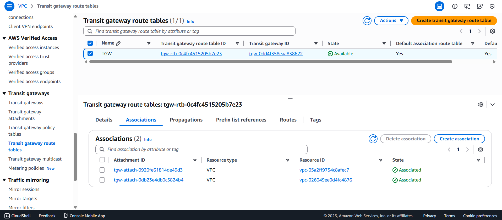
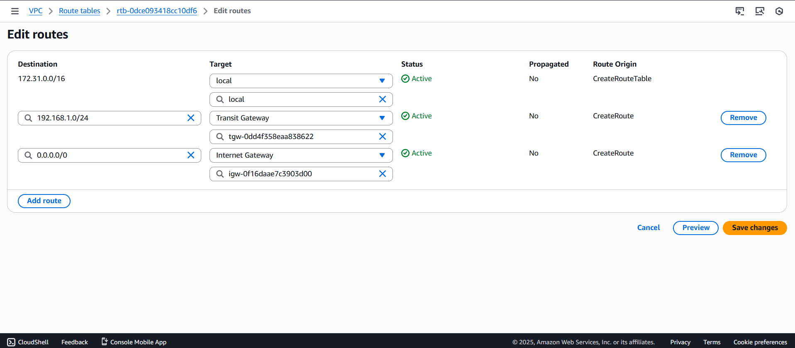

## AWS Transit Gateway 

AWS **Transit Gateway (TGW)** is a fully managed networking service that enables centralized connectivity between multiple **VPCs**, **on-premises networks**, and **VPN connections** using a **hub-and-spoke architecture**. Instead of creating complex VPC peering connections, Transit Gateway acts as a **single routing hub**, simplifying network management and improving scalability.

---

## Architecture Diagram

---

## Implementation Steps

## Step 1: Create Transit Gateway
1. Go to **VPC**
2. Click **Transit Gateways**
3. Click **Create transit gateway**

---

## Step 2: Create Transit Gateway Attachment – Default VPC (Attachment 1)
1. Click **Transit Gateway Attachments**
2. Click **Create attachment**
3. Select the following:
   - **Transit Gateway**: Demo_TGW
   - **Attachment type**: VPC
   - **VPC**: Default VPC
   - **Subnets**: Select at least one subnet per Availability Zone
4. Click **Create attachment**

## Step 3: Create Transit Gateway Attachment – Custom VPC (Attachment 2)
1. Click **Transit Gateway Attachments**
2. Click **Create attachment**
3. Select the following:
   - **Transit Gateway**: Demo_TGW
   - **Attachment type**: VPC
   - **VPC**: Custom VPC
   - **Subnets**: Select at least one subnet per Availability Zone
4. Click **Create attachment**

---

## Step 4: Configure Transit Gateway Route Table
1. Click **Transit Gateway Route Tables**
2. Select the **default Transit Gateway route table**
3. Go to the **Route Propagation** tab
4. Enable route propagation for:
   - **Default VPC attachment**
   - **Custom VPC attachment**
5. Save the changes

 

 ---

 ## Step 5: Add Routes in Default VPC Route Table
1. Select **Route Tables**
2. Choose the **Default VPC route table**
3. Click **Edit routes**
4. Add the following route:
   - **Destination**: 192.168.0.0/24
   - **Target**: Transit Gateway
5. Save the route

 

---

## Step 6: Add Routes in Custom VPC Route Table
1. Select **Route Tables**
2. Choose the **Custom VPC route table**
3. Click **Edit routes**
4. Add the following route:
   - **Destination**: 172.31.0.0/16
   - **Target**: Transit Gateway
5. Save the route

 

 ---

 ## Conclusion

This project demonstrates how **AWS Transit Gateway** enables centralized and scalable communication between multiple VPCs. By attaching both the Default VPC and a Custom VPC to a single Transit Gateway and configuring proper routing, secure and efficient VPC-to-VPC connectivity was achieved.

Transit Gateway simplifies network architecture, reduces operational complexity, and is ideal for enterprise and multi-VPC environments.

 
  

