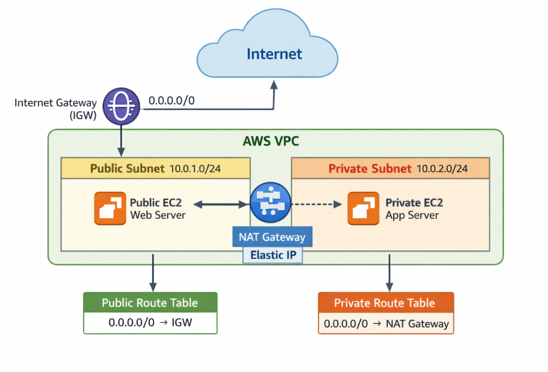
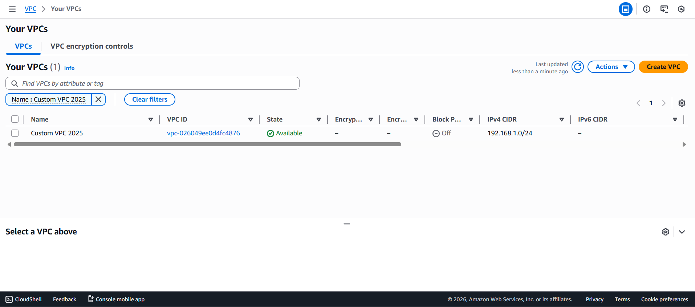
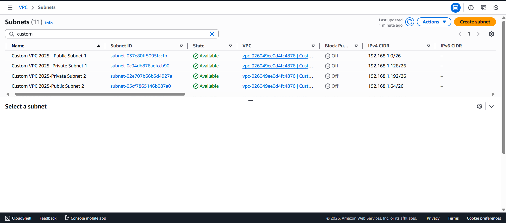
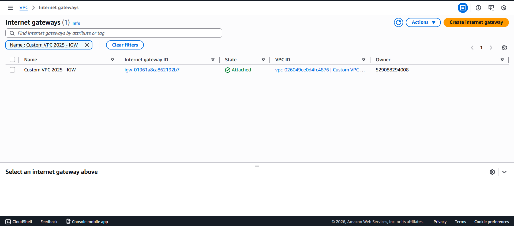
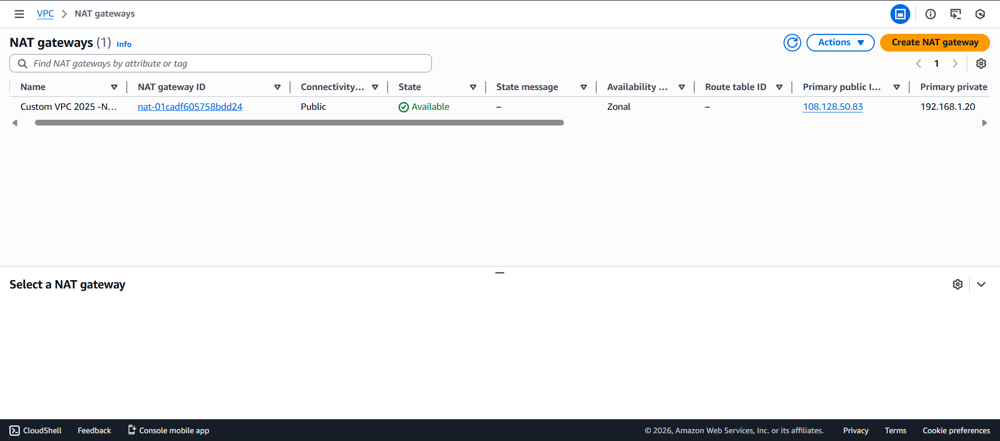
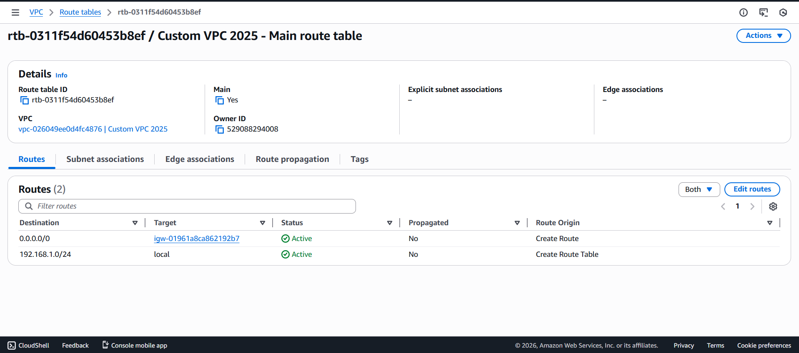
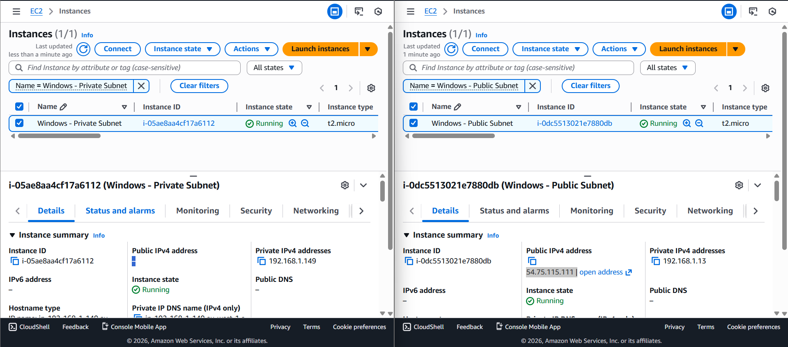
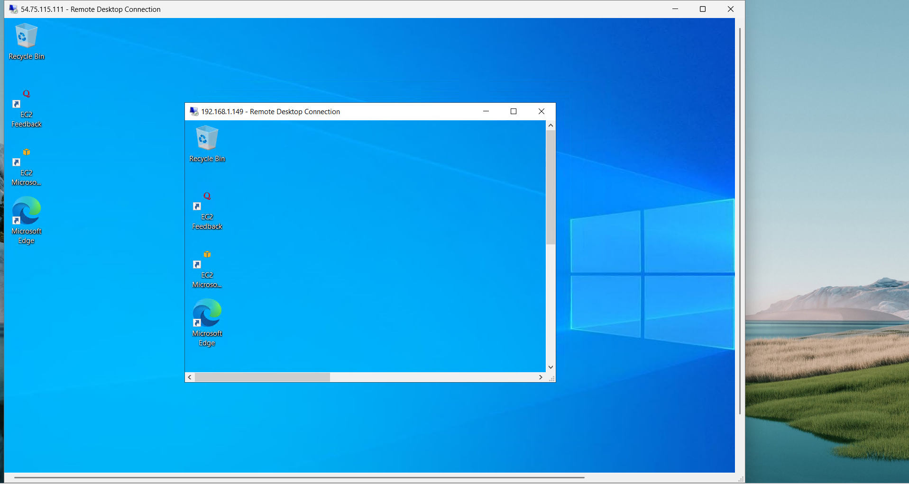

#  AWS VPC Project – Public & Private Subnet Architecture

This project demonstrates the implementation of a **secure Amazon VPC** with **public and private subnets** following AWS best practices.  
It shows how internet access is managed securely using **Internet Gateway** and **NAT Gateway**.

---

##  Architecture Diagram

## Implementation Steps

### Step 1️: Create VPC
A VPC was created with the CIDR block `10.0.0.0/16`.  
DNS resolution and DNS hostnames were enabled.

 

---

### Step 2️: Create Subnets
Two subnets were created inside the VPC:

- **Public Subnet:** 
- **Private Subnet:**

Public subnet was configured to auto-assign public IPv4 addresses.

  

---

### Step 3️: Internet Gateway
An Internet Gateway was created and attached to the VPC to allow internet access for public resources.

 

---

### Step 4: NAT Gateway
A NAT Gateway was created in the public subnet using an Elastic IP.  
This enables private subnet instances to access the internet securely.

---

### Step 5: Route Tables
Two route tables were configured:

**Public Route Table**
- `0.0.0.0/0 → Internet Gateway`

**Private Route Table**
- `0.0.0.0/0 → NAT Gateway`

 

---

### Step 6:Launch EC2 Instances
Two EC2 instances were launched:

- **Public EC2 Instance**
  - Located in public subnet
  - Accessible from the internet

- **Private EC2 Instance**
  - Located in private subnet
  - No public IP
  - Internet access via NAT Gateway

 

---

##  Verification
- Public EC2 is reachable via browser or SSH
- Private EC2 can access the internet
- Private EC2 is not directly accessible from the internet

  

---

##  Result

After completing the VPC setup, the following results were successfully verified:

- ✅ Public EC2 instance is accessible from the internet using its public IP address  
- ✅ Internet traffic flows through the Internet Gateway for public subnet resources  
- ✅ Private EC2 instance does NOT have a public IP address  
- ✅ Private EC2 instance can access the internet securely via the NAT Gateway  
- ✅ Route tables correctly control traffic flow between subnets  
- ✅ Security Groups restrict and allow traffic as per best practices

---

##  Conclusion

This project demonstrates the successful implementation of a **secure and scalable AWS VPC architecture** using public and private subnets.  
By integrating an **Internet Gateway** and a **NAT Gateway**, the setup ensures controlled internet access while keeping private resources isolated from direct exposure.

---
