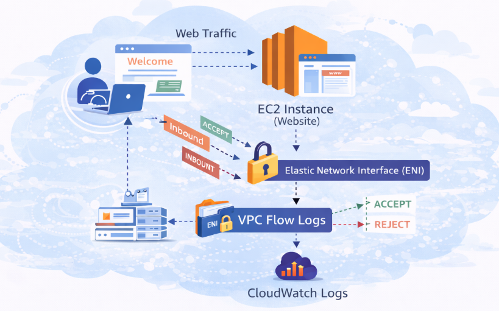
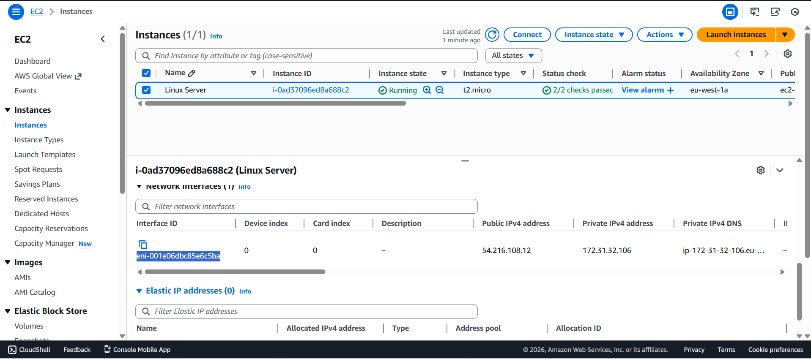
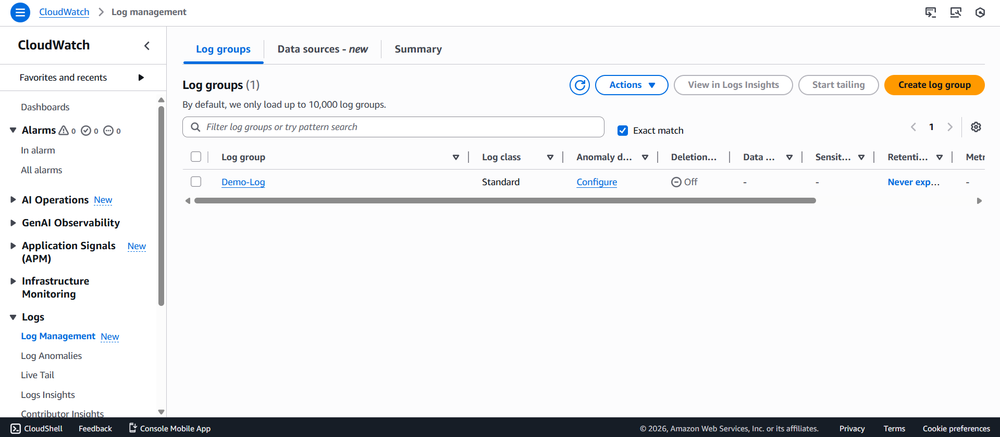
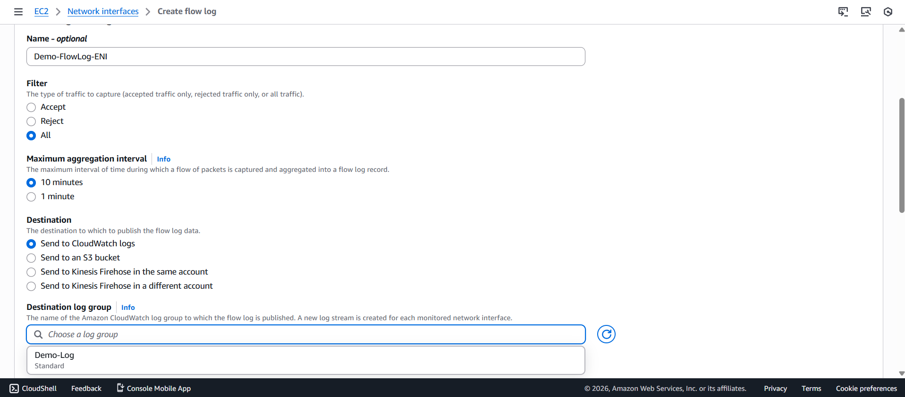
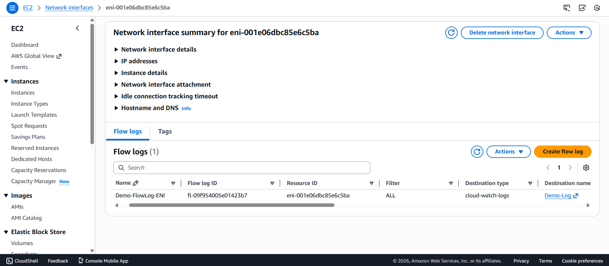
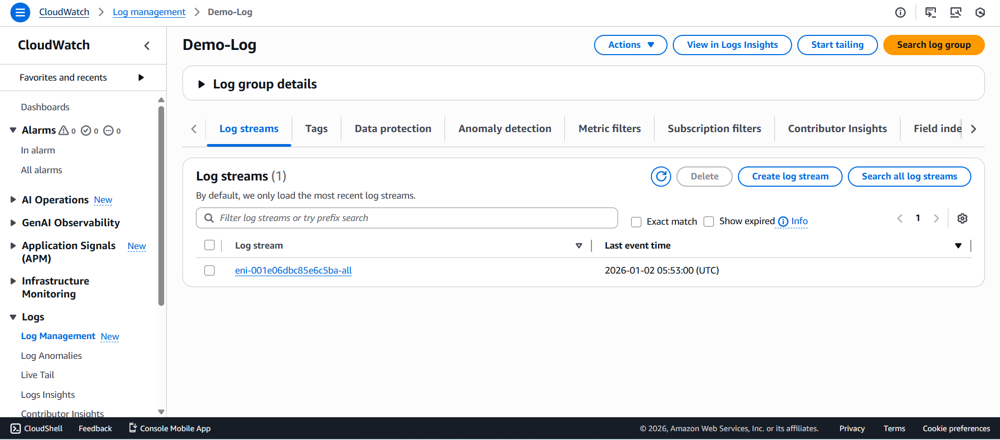
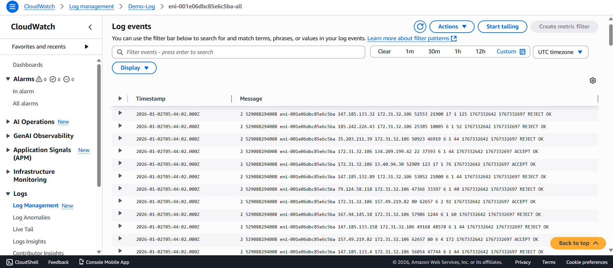

##  VPC Flow Logs 
VPC Flow Logs capture **IP traffic metadata** for network interfaces within an Amazon VPC.  They help monitor **inbound and outbound traffic**, identify security issues, and troubleshoot network connectivity.

Flow logs can be created at:
- **VPC level**
- **Subnet level**
- **Network Interface (ENI) level**

Captured information includes:
- Source and destination IP address
- Source and destination ports
- Protocol
- Packet and byte count
- Traffic status (**ACCEPT / REJECT**)

---

##  Architecture Diagram

---

### Step 1: Launch EC2 Instance with User Data
- Launched an **Amazon Linux 2** EC2 instance in a public subnet
- Enabled **Auto-assign public IPv4**
- Allowed **HTTP (80)** and **SSH (22)** in security group
- Added User Data script to install Apache and deploy a website

---

### Step 2: Create Log Group in CloudWatch
- Opened **CloudWatch → Logs → Log groups**
- Clicked **Create log group**

---

### Step 3: Create ENI Flow Logs for EC2
- Navigated to **EC2 → Network Interfaces**
- Selected the **ENI attached to the EC2 instance**
- Clicked **Actions → Create flow log*

---

### Step 4: Log Stream Generated in CloudWatch
- Opened **CloudWatch → Logs → Log groups**

---

### Step 5: Traffic Generated
- Accessed the EC2 **public IP address** from a web browser multiple times
- Generated HTTP traffic to the EC2 instance
- Additional traffic created using SSH connection
- Traffic successfully captured by **ENI Flow Logs**

---

##  Conclusion
In this project, VPC Flow Logs were enabled at the **ENI level** for an EC2 instance.  Traffic was generated by accessing the website and SSH, and logs were successfully captured in **CloudWatch Log Streams**.

This implementation provides:
- Improved **network visibility**
- Enhanced **security monitoring**
- Effective **troubleshooting capabilities**
