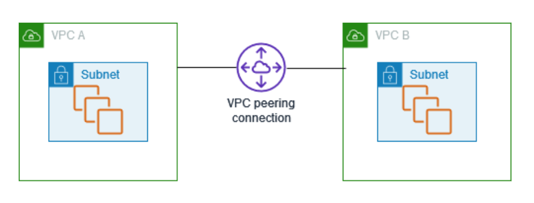
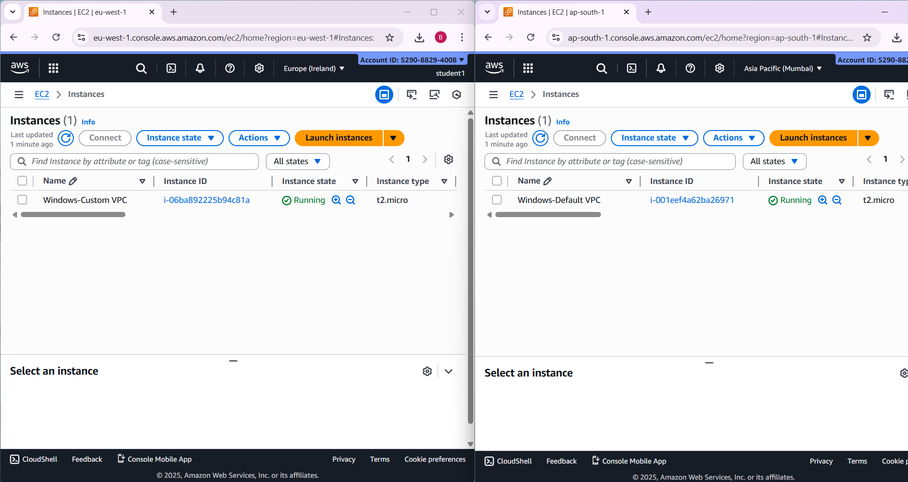
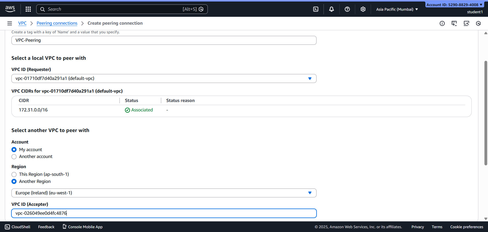
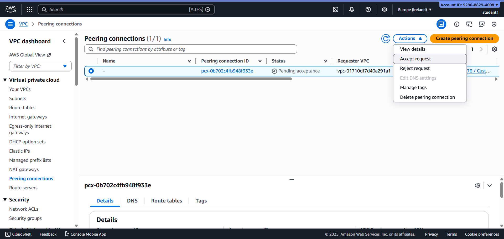
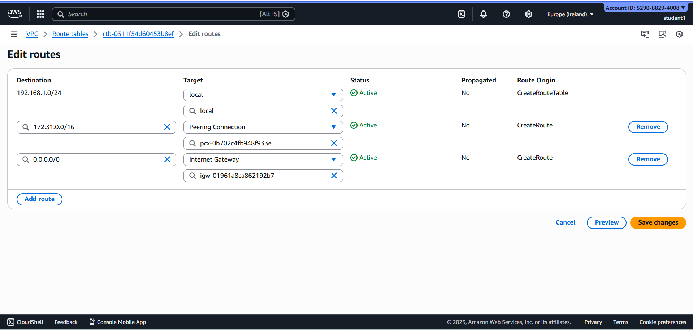
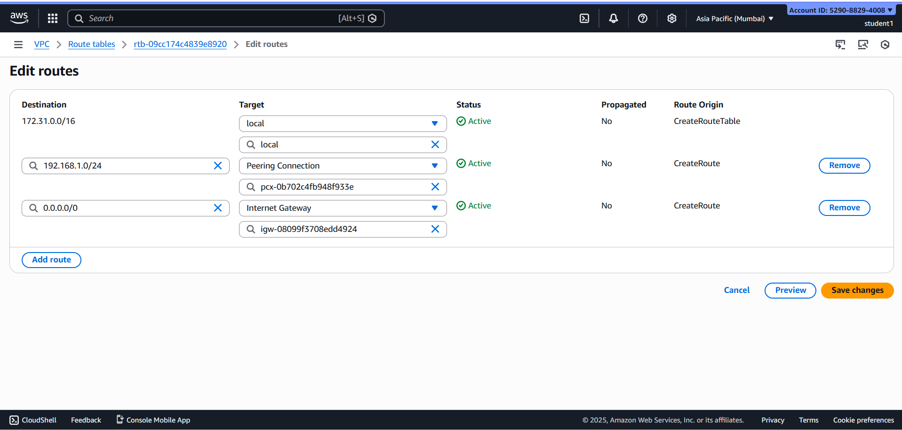

# Cross-Region VPC Peering – Ireland (eu-west-1) ↔ Mumbai (ap-south-1)

##  Project Overview
This project demonstrates **cross-region VPC peering** between:
- A **Custom VPC** in **Ireland (eu-west-1)** with a **Windows EC2 instance**
- The **Default VPC** in **Mumbai (ap-south-1)** with a **Windows EC2 instance**

VPC peering enables **private communication using private IP addresses** across AWS regions without using the public internet.

---

##  Objective
- Launch Windows EC2 instances in two different regions
- Create cross-region VPC peering
- Update route tables on both VPCs
- Verify private connectivity between instances

---

##  Architecture Diagram

---

##  Implementation Steps

### Step 1: Launch Windows EC2 in Custom VPC (Ireland)
- Created a **custom VPC** with CIDR '192.168.1.0/24'
- Created subnet and route table
- Launched **Windows EC2 instance** in Ireland region

### Step 2: Launch Windows EC2 in Default VPC (Mumbai)
- Used AWS **default VPC**
- Launched **Windows EC2 instance** in Mumbai region
- Verified instance status

---

### Step 3: Create VPC Peering Request from Mumbai
- Initiated VPC peering request from **Mumbai default VPC**
- Target VPC selected from **Ireland region**
- Peering request sent successfully

---

### Step 4: Accept VPC Peering Request in Ireland
- Switched to **Ireland region**
- Accepted the incoming peering request
- Peering connection status changed to **Active**

---

### Step 5: Add Routes in Custom VPC (Ireland)
- Updated route table in Ireland custom VPC
- Added route:
  - Destination: `172.31.0.0/16`
  - Target: VPC Peering Connection

---

### Step 6: Add Routes in Default VPC (Mumbai)
- Updated default route table in Mumbai
- Added route:
  - Destination: `192.168.1.0/24`
  - Target: VPC Peering Connection
 

---

### Step 7: Verification
- Connected to Windows EC2 in Ireland
- Verified connectivity using private IP
- Cross-region communication successful

---

##  Limitations
- No transitive routing
- No overlapping CIDRs
- Cannot use peering as hub-and-spoke

---

##  Conclusion
This project demonstrates how **cross-region VPC peering enables secure private communication** between EC2 instances in different AWS regions. It is useful for global architectures and disaster recovery setups.

