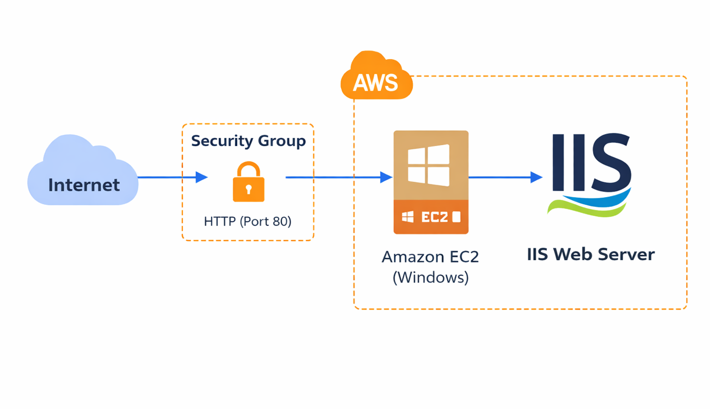
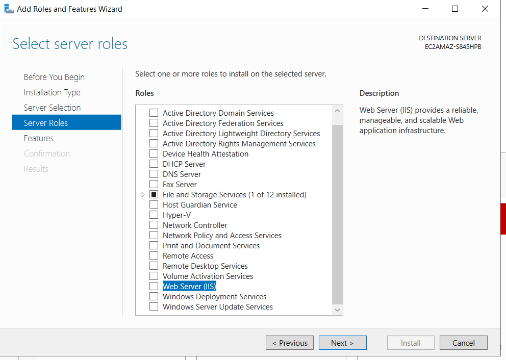

Host a Website on Windows EC2 using IIS

This repository documents the setup and deployment of a static website hosted on a *Windows EC2 instance* using *Internet Information Services (IIS)* on Amazon Web Services.The project focuses on Windows-based server management, secure remote access, and basic web hosting fundamentals in the AWS cloud.

Architecture
- A Windows Server EC2 instance runs inside the default VPC.
- IIS Web Server is installed on the EC2 instance to serve website content.
- Security Groups control inbound access (RDP and HTTP).
- Users access the website using the EC2 public IPv4 address.

*Amazon EC2 (Windows Server):* 
Provides a virtual Windows server to host and run the IIS Web Server.

*Security Groups:*  
Act as a virtual firewall controlling inbound and outbound traffic to the EC2 instance.

*Internet Information Services (IIS):* 
Microsoft’s web server used to host and serve the static website content.

 Request Flow (End-User Perspective)
1. A user enters the EC2 public IPv4 address in a browser (for example, `http://3.xxx.xxx.xxx`).
2. The request reaches the EC2 instance through port *80 (HTTP)*
3. IIS receives the request and serves the website files stored in `C:\inetpub\wwwroot`.
4. The website content is returned to the user’s browser.

 Security & Access Flow
- Remote administration is performed using *RDP (port 3389)*.
- RDP access is restricted to a specific IP address for security.
- Public HTTP access (port 80) allows users to view the website.
- The administrator password is decrypted using the EC2 key pair for secure login.

Features
- Windows-based web hosting on AWS.
- Secure administrative access using RDP.
- Publicly accessible website via EC2 public IPv4.
- Simple and cost-effective setup for learning and testing.

 Hands On

### Step 1: Launch Windows EC2 Instance

1. Open the **AWS Management Console**.
2. Navigate to **EC2** → **Launch instance**.
3. Choose a **Windows Server AMI**.
4. Select an instance type (for example, `t2.micro` for free tier).
5. Create or select a key pair.
6. Launch the instance and wait for the **Instance state: Running**.
7. Verify **Status checks: 2/2 checks passed**.

---

### Step 2: Configure Security Group

Configure inbound rules:
- **RDP (3389)** → Source: My IP
- **HTTP (80)** → Source: Anywhere (0.0.0.0/0)

---

### Step 3: Connect to the Instance (RDP)

1. Select the EC2 instance → **Connect**.
2. Choose **RDP client**.
3. Download the Remote Desktop file.
4. Decrypt the administrator password using the key pair.
5. Connect to the instance using RDP.

### Step 4: Install IIS Web Server

1. Open **Server Manager** on the Windows instance.
2. Click **Add roles and features**.
3. Select **Web Server (IIS)**.
4. Complete the installation.
5. Verify IIS by opening `http://localhost` in the browser.

---

### Step 5: Deploy Website Content

1. Navigate to:C:\inetpub\wwwroot

2. Replace the default IIS files with your website files (`index.html`, CSS, images).
3. Save the changes.

---

### Step 6: Access the Website Publicly

1. Copy the EC2 **Public IPv4 address**.
2. Open a browser and visit:

3. Verify the website loads successfully.

## Result

The website is successfully hosted on a Windows EC2 instance and is publicly accessible via the EC2 public IPv4 address using IIS.

## Key Learnings

- Launching and managing Windows EC2 instances
- Secure RDP access using key pairs
- IIS Web Server installation and configuration
- Security Group best practices
- Hosting static websites on AWS using Windows servers

